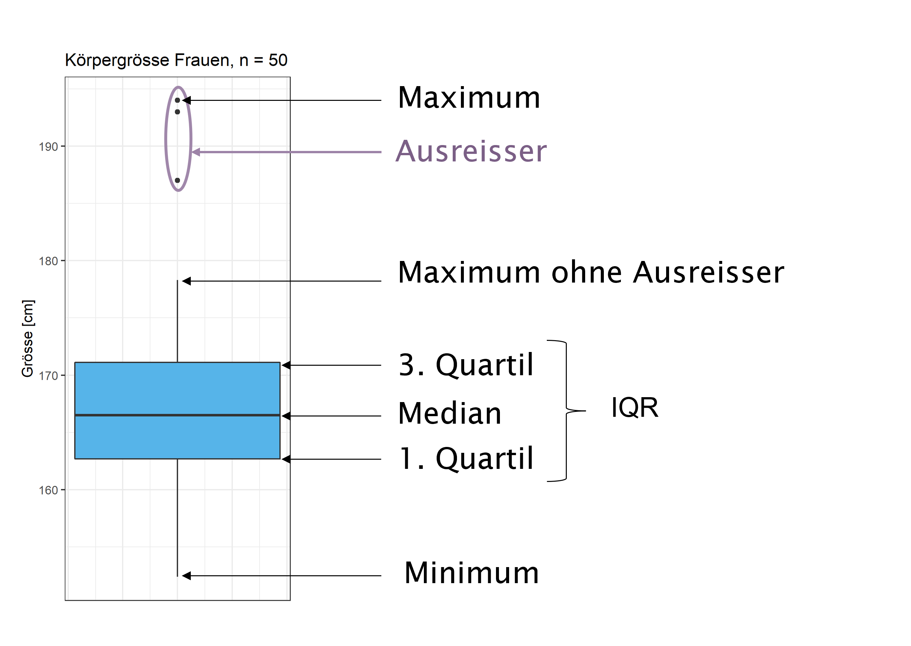

```{r setup-02, include=FALSE}
rm(list = ls())

knitr::opts_chunk$set(echo = FALSE, 
                      warning = FALSE, 
                      message = FALSE,
                      fig.align = "center")

library(openintro)
library(tidyverse)
library(knitr)
library(patchwork)
library(kableExtra)

ggred <- "#F8766D"
ggblue <- "#00BFC4"
ggreen <- "#7CAE00"
ggviolet <- "#C77CFF"

data(COL)
library(scales)
show_col(COL[1:20])

#openintro_palettes # Hex for openintro COLs

# Probleme beim rendern: https://stackoverflow.com/questions/66305776/got-knit-issue-with-r, solution:
# tinytex::tlmgr_install("pdfcrop")
# install ghostscript https://www.ghostscript.com/download/gsdnld.html
# Sys.setenv(R_GSCMD="C:/Program Files/gs/gs9.54.0/bin/gswin64.exe")
```

# Deskriptive Statistik

> Ein Bild sagt mehr als tausend Worte. 

Jede statistische Analyse beginnt mit der Beschreibung und der Zusammenfassung 
der vorliegenden Daten. In diesem Kapitel geht es darum, wie die verschiedenen Datentypen, 
durch Kennzahlen und Grafiken geeignet zusammengefasst und präsentiert werden können.   


## Lernziele   

1. Beschreibe Daten mit den Begriffen Beobachtungseinheit, Beobachtungsmerkmal 
(= Variable), Ausprägung von Beobachtungsmerkmalen.   
2. Unterscheide quantitative und qualitative Daten.   
  - Unterscheide bei quantitativen Daten zwischen kontinuierlichen und diskreten 
  Variablen.  
  - Unterscheide bei qualitativen Daten zwischen nominalen (= kategoriale) und 
  ordinalen Variablen.   
3. Erwähne bei der Beschreibung von quantitativen Daten die Form der Verteilung 
und die Kennzahlen der Lage und der Streuung.   
  - Kennzahlen der Lage: Mittelwert $\bar{x}$ und Median  
  - Kennzahlen der Streuung: Varianz $s^2$, Standardabweichung $s$, Variationsbreite  
  (= Spannweite) und Interquartilabstand ($IQR$, engl. interquartile range)   
4. Beschreibe die Verteilung einer Variable als symmetrisch, rechtsschief oder 
linksschief.   
5. Verwende Histogramme und Boxplots um die Verteilung von quantitativen Daten 
zu beschreiben.   
6. Definiere *robuste statisische Kennzahlen* wie Median und IQR als Kennzahlen, 
die wenig von der Verteilungsform und von Ausreissern beeinflusst werden.  
7. Verwende Kreuztabellen und Balkendiagramme zur Beschreibung von qualitativen Daten.  

## Grundbegriffe   

Wir verwenden in diesem Kapitel einen Datensatz mit biometrischen Merkmalen von 
Studierenden 

```{r phy-import}
phy <- read_csv("./data/02_phy.csv", show_col_types = FALSE)


head(phy, 5) %>% 
  kable(caption = "Daten der ersten 5 Studierenden im Datensatz phy.csv (n = 228)") %>% 
  kable_classic(full_width = FALSE)
```

Codebook:  


**ID:** Student:in  
**Kohorte:** Jahrgang: PHY14, PHY15, PHY16, PHY17   
**Klasse:** Klasse: 1, 2  
**Geschlecht:** Geschlecht: m = männlich, w = weiblich    
**Augenfarbe:** Farbe: blau, grün, braun  
**Groesse:** Körpergrösse in cm   
**Gewicht:** Körpergewicht in kg    
**Statistik:** Interesse am Fach Statistik $^a$      

$^a$ Frage: "Statistik interessiert mich"   
Auswahlitems:  
1 trifft nicht zu     
2 trifft kaum zu   
3 trifft etwas zu    
4 trifft eher zu   
5 trifft sehr zu   

In der Statistik beobachten wir typischerweise verschiedene **(Beobachtungs-)Merkmale**, 
wie das Geschlecht, die Körpergröße oder die Zugehörigkeit zu einer Klasse in der 
Datenerhebung im Studiengang Physiotherapie, an **Beobachtungseinheiten**, im
vorliegenden Fall an Studierenden. Solche Merkmale bezeichnen wir als **Variablen** 
und die Werte, welche die Variablen annehmen können als **Merkmalsausprägungen**.   

Bei der Datenerhebung in Studien werden die Daten in Tabellen erfasst. In diesen  
Datentabellen (Datensätzen) wird für jedes erhobene Merkmale in eine separate Spalte erstellt. 
Jede Beobachtungseinheit wird in einer separaten Zeile erfasst, in der die jeweilige 
Ausprägung der Merkmale eingetragen wird. Ein Fehler der häufig gemacht wird, ist 
der, dass pro Zelle mehr als eine Ausprägung erfasst wird, was die spätere Auswertung 
der Daten erheblich erschwert oder sogar unmöglich macht [@wickham-tidydata].  

## Quantitative und qualitative Daten

Als erste Eigenschaft unterscheiden wir zwischen qualitativen und quantitativen 
Variablen, je nachdem, welche Werte die Variable annehmen und wie man 
mathematisch damit umgehen kann kann. 

**Quantitative** Variablen sind Beobachtungsmerkmale, die wir durch Messen oder 
Zählen ermitteln. Mit quantitativen Daten können wir sinnvolle mathematische 
Operationen durchführen, wie z.B. einen Durchschnitt bestimmen.  

Bei quantitativen Daten unterscheiden wir zwei Unterkategorien:  

- quantitativ-**kontinuierliche** Variablen werden durch Messung erhoben. Sie 
werden auch als *numerische* oder *stetige* Variablen bezeichnet. Im phy-
Datensatz sind `Groesse`, `Gewicht` und `Schuhgroesse` kontinuierliche Variablen.  
- quantitativ-**diskrete** Variablen werden durch Zählen erhoben. Sie können nur 
ganzzahlige Werte annehmen. Beispiele sind Anzahl roter Blutkörperchen pro ml Blut  
oder die Anzahl Geschwister.

**Qualitative** Variablen sind Beobachtungsmerkmale, die wir nicht durch messen 
oder zählen sondern durch direkte Anschauung ermitteln. Qualitative Daten lassen 
sich nicht sinnvoll addieren oder subtrahieren, d.h. wir können z.B. keinen 
Durchschnitt wie bei quantitativen Daten berechnen. Qualitative Daten eignen 
sich jedoch für Vergleiche z.B. für den Vergleich der durchschnittlichen 
Körpergrösse von Männern und Frauen. 

Auch bei qualitativen Daten unterscheiden wir zwei Unterkategorien:  

- qualitativ-**nominal**: Die Variable gibt eine Gruppenzugehörigkeit an. Im phy-
Datensatz sind die Variablen `ID`, `Kohorte`, `Klasse`, `Augenfarbe` und `Geschlecht` 
diesem Variablentyp zuzuordnen.   
- qualitativ-**ordinal**:  Bei diesem Typ sind die Kategorien logisch geordnet, 
wie z. B. der Schweregrad einer Krankheit oder die Antworten „stimme nicht zu“, 
„stimme teilweise zu“, „stimme zu“ in einer Umfrage. Im phy-Datensatz entspricht die 
Variable `Statistik` diesem Variablentyp.   


## Quantitative Daten zusammenfassen   

Mit Hilfe von **Kennzahlen** lassen sich Variablen zusammenfassen. Kennzahlen der
zentralen Tendenz (Lagemasse) geben Auskunft über den "Schwerpunkt" einer Variable und Kennzahlen der Streuung vermitteln uns einen Eindruck darüber, wie die Variablenwerte um 
diesen Schwerpunkt verteilt sind. In vielen Fällen sind Grafiken (engl. plots) 
einfacher lesbar als umfangreiche Tabellen.   

### Kennzahlen der zentralen Tendenz (Lagemasse)  

**Mittelwert**   

Das gebräuchlichste Lagemass ist der Mittelwert (auch Durchschnitt).Der Mittelwert ist derjenige Wert, der die Daten auf einer „Waage“ ausbalanciert. Wir nehmen dabei 
an, dass die Waage kein Gewicht hat und alle Beobachtungen gleich schwer sind. 
Weit entfernte Beobachtungen haben eine starke „Hebelkraft“, also einen starken 
Einfluss auf den Mittelwert.   

Der Mittelwert (engl. mean) von $n$ Beobachtungen $x_1, x_2, ..., x_n$ ist   

$$\bar{x} = \frac{(x_1 + x_2 + ... + x_n)}{n} = \frac{1}{n} \sum_{i=1}^n x_i$$

```{r mean-dotp-fig, fig.align='center', fig.dim = c(8, 3), fig.cap="Mittelwert"}
alter <- c(18, 19, 20, 21, 21, 22, 22, 23, 23, 24, 26, 18, 19, 20, 21, 21, 22, 22, 23, 23, 36, 37)

gruppe <- factor(c(rep("a", 11), rep("b", 11)))
alter_tib <- tibble(
  Alter = alter,
  gruppe = gruppe
)

m_alter <- alter_tib %>% 
  group_by(gruppe) %>% 
  summarise(
    m = round(mean(Alter), 1),
    median = median(Alter)
    )

p1<- alter_tib %>% 
  filter(gruppe == "a") %>% 
  group_by(gruppe) %>% 
  ggplot(., aes(x = Alter)) +
  geom_dotplot(binwidth = 1, fill = COL[1]) +
  ylab("") +
  scale_y_continuous(breaks = NULL) +
  xlim(c(18, 37)) +
  theme_grey()

p1m <- p1 +
  geom_text(x=23.8, y=.5, label= m_alter$m[1], color = COL[4], size = 6) +
  geom_vline(xintercept = m_alter$m[1], color = COL[4])

p2 <- alter_tib %>% 
  filter(gruppe == "b") %>% 
  group_by(gruppe) %>% 
  ggplot(., aes(x = Alter)) +
  geom_dotplot(binwidth = 1, fill = COL[1]) +
  ylab("") +
  scale_y_continuous(breaks = NULL) +

  xlim(c(18, 37)) +
  theme_grey()

p2m <- p2 +
    geom_text(x=26, y=.5, label= m_alter$m[2], color = COL[4], size = 6) +
    geom_vline(xintercept = m_alter$m[2], color = COL[4])

(p1m | p2m)
```

In der Abbildung \@ref(fig:mean-dotp-fig) ist erkennbar, dass wenn die zwei höchsten 
Werte aus der Abbildung links nach rechts verschoben werden, also höhere Werte 
annehmen, sich auch der Mittelwert nach rechts verschiebt.  

Den Mittelwert einer Variable in `R` berechnen [@R-base]:   

```{r rfun_mean, echo=TRUE}
### R-Code

# Daten generieren   
x <- c(2, 2, 3, 3, 4)

# Mittelwert von x berechnen
mean(x)
```


**Median**   

Der Median beschreibt die „Mitte“, den „50 %-Punkt“ der Daten. Als Spezialfall eines Perzentils ist der Median definiert als ein Wert, der die Daten in zwei gleiche Hälften teilt.

Bestimmung des Medians:   

- Gegeben ist eine Variable $x$ mit den Werten $x = (3, 2, 2, 2, 4)$  
- Werte der Variablen $x$ nach Grösse sortieren: $2, 2, 2, 3, 4$  
- Der Wert, der die Zahlenreihe halbiert ist der Median: $Median = 2$   

Wenn die Variable eine geradzahlige Anzahl an Werten hat,  

- bestimmen wir das arithmetische Mittel der beiden mittleren Werte: 
$x = (3, 2, 2, 2, 4, 4)$  
- Werte nach Grösse sortieren: $2, 2, 2, 3, 4, 4$   
- Die beiden mittleren Werte sind $2$ und $3$, das arithmetische Mittel ist 2.5, d.h. 
$Median = 2.5$   

Den Median einer Variable in `R` berechnen:  

```{r rfun-median, echo=TRUE}
### R-Code

# Daten generieren   
x <- c(2, 2, 2, 3, 4)

# Median von x berechnen
median(x)

# Höchsten Wert von x erhöhen   
x <- c(2, 2, 2, 3, 20)  

# Median von x berechnen   
median(x)  

# Variable x mit geradzahliger Anzahl an Werten 
x <- c(3, 2, 2, 2, 4, 4)

# Median von x berechnen   
median(x)  
```

Einfluss extremer Werte auf den Median:  

```{r median-dotp-fig, fig.align='center', fig.dim = c(8, 3), fig.cap="Median"}
p3 <- p1 +
  geom_text(x=23.8, y=.5, label= m_alter$median[1], color = COL[2], size = 6) +
  geom_vline(xintercept = m_alter$median[1], color = COL[2])

p4 <- p2 +
  geom_text(x=23.8, y=.5, label= m_alter$median[2], color = COL[2], size = 6) +
  geom_vline(xintercept = m_alter$median[2], color = COL[2])

(p3 | p4)
```

Die Abbildung \@ref(fig:median-dotp-fig) zeigt, dass eine Verschiebung der beiden 
höchsten Werte in der Abbildung links keinen Einfluss auf den Median hat. Die Eigenschaft, 
dass eine Kennzahl oder Methode nicht stark von einzelnen Werten abhängt, bezeichnet man 
als **robust**.

> Merke: Der Mittelwert ist empfindlich für Extremwerte, der Median hingegen ist *robust*.  

**Mittelwert oder Median**  

Auswahl der Kennzahl der Lage ist abhängigig davon, wie die Daten verteilt sind und 
welchen Aspekt der Verteilung mit der Kennzahl dokumentiert werden soll.  

Wir illustrieren das am Beispiel der Verteilung der monatlichen Einkommens von 
Schweizer Frauen im Jahr 2018 [Bundesamt für Statistik](https://www.bfs.admin.ch/bfs/de/home/statistiken/arbeit-erwerb/loehne-erwerbseinkommen-arbeitskosten/lohnniveau-schweiz/verteilung-nettoloehne.html).

```{r income-f-fig, fig.align='center', fig.dim=c(7, 5), fig.cap="Monatliches Einkommen Frauen CH, 2018"}
# https://www.bfs.admin.ch/bfs/de/home/statistiken/arbeit-erwerb/loehne-erwerbseinkommen-arbeitskosten/lohnniveau-schweiz/verteilung-nettoloehne.html 
income <- read_csv("./data/02_income_ch_f_2018.csv")

# für jedes Lohnband gemäss Prozentangaben Daten erstellen
code <- income$code
prozent <- income$prozent
income <- vector()
for (i in 1:21){
  inc <- code[i]
  mal <- prozent[i] * 10
  x <- rep(inc, times = mal)
  income <- c(income, x)
}
einkommen <- tibble(Einkommen = income)

# Mittelwert und Median berechnen
sum <- einkommen %>% 
  summarise(
    M = mean(Einkommen),
    Median = median(Einkommen)
  )
sum <- round(sum, 1)

# Histogramm erstellen
ggplot(einkommen, aes(x = Einkommen)) +
  geom_histogram(fill = COL[1], color = "white", binwidth = 1) +
  xlab("CHF (in Tausend)") +
  ylab("Häufigkeit") +
  geom_vline(xintercept = sum$M, color = COL[4], lwd = 1) +
  geom_vline(xintercept = sum$Median, color = COL[2], lwd = 1) +
  ggtitle("Monatliches Einkommen Frauen CH, 2018",
          subtitle = paste("Mittelwert (rot) = CHF", sum$M * 1000, ", Median (grün) = CHF", sum$Median * 1000)) +
  theme_grey()
```

Das monatliche Einkommen ist rechtsschief verteilt. Es beträgt im Durchschnitt CHF 4600.-, der Median liegt mit CHF 4000.- um CHF 600.- (13%) tiefer. Der Mittelwert ist vergleichsweise hoch, weil einige wenige sehr gut verdienende Personen diesen "nach oben" ziehen. Für die Einzelperson hat daher der Mittelwert wenig Aussagekraft, informativer ist für diese der Median. Die Steuerbehörde interessiert sich eher für den Mittelwert, der es z.B. erlaubt, das totale Einkommen der Stadt und die zu erwartenden Steuern zu berechnen.  

Ob zur Charakterisierung einer Variablen der Mittelwert oder Median verwendet werden soll, ist von den Antworten auf die folgenden Fragen abhängig:  

- Soll ein typischer (Median) oder durchschnittlicher (Mittelwert) Wert als Repräsentant der Variablen angegeben werden.  
- Was hat die Verteilung für eine Form? Ist sie schief oder symmetrisch?   
- Welche inferenzstatistischen Auswertungsmethoden werden für die Variable gewählt? Wenn parametrische Verfahren (t-Tests) durchgeführt werden wird eher der Mittelwert 
angegeben, wenn nicht-parametrische Verfahren (Rangtests) durchgeführt werden wird eher 
der Median berichtet.  


**Perzentile**   

Perzentile (auch Quantile) sind Hilfsmittel zur Beschreibung der Verteilung von 
Daten. Die Definition für ein Perzentil ist etwas schwerfällig:       

*Eine Zahl $p_k$ heißt $k$-tes Perzentil ($k$ bezeichnet hierbei eine ganze Zahl zwischen 1 und 99) einer Variablen, wenn mindestens $k$ % der Beobachtungen der Variable kleiner oder gleich $p_k$ und mindestens (100 - $k$) %größer oder gleich $p_k$ sind.*   

Einfacher geht es mit einem Beispiel: Uns interessiert, wo die Einkommensgrenze 
zwischen dem unteren und dem mittleren Drittel liegt. Das bedeutet, wir müssen das 
33. Perzentil der Einkommensverteilung bestimmen.

```{r Rquantile, echo=TRUE}
### R-Code

# 33. Perzentile berechnen
quantile(einkommen$Einkommen, .33)
```

Interpretation: Wir erhalten für die 33. Perzentile den Wert 3. Die Angaben sind 
jeweils mit 1000 zu multiplizieren. Die 33% Frauen mit dem niedrigsten monatlichen 
Einkommen verdienen zwischen 0 und 3000 CHF.

**Quartile** sind spezielle Perzentilen, welche eine Variable in vier gleiche Teile 
unterteilen. Das 1. Quartil (auch unteres Quartil) ist das 25. Perzentil, das 2. Quartil ist das 50. Perzentil (also der Median) und das 3. Quartil (auch oberes Quartil) ist das 75. Perzentil. 

```{r Rquartiles, echo=TRUE}
### R-Code

# Quartile berechnen
quantile(einkommen$Einkommen, c(.25, .5, .75))
```

Intepretation:   

- 25% der Frauen verdienen CHF 3000.- oder weniger 
- 25% der Frauen verdienen zwischen CHF 3000 und 4000.  
- 25% der Frauen verdienen zwischen CHF 4000 und 6000.
- 25% der Frauen verdienen CHF 6000.- oder mehr.


### Exkurs: Der Mittelwert als Kleinst-Quadrat-Modell      

Im Hinblick auf das Streuungsmass Varianz und später erläuterte statistische Methoden 
wird hier ergänzend ein etwas anderes Konzept des Mittelwerts vorgestellt.

Beispiel: Wie viele Freunde haben Statistik-Lehrer?   

Aus einer kleinen Umfrage liegen uns die Daten für fünf Statistiklehrer vor:

```{r statlehrer-freunde-tib}
mw_tib <- tibble(
  ID = seq(from = 1, to = 5, by = 1),
  Freunde = c(1, 2, 3, 3, 4)
) 
mw_tib %>% 
  kbl(caption = "Anzahl Freunde von Statistiklehrern") %>% 
  kable_classic(full_width = FALSE)
```


```{r statlehrer-scatter-fig, fig.dim=c(4, 3), fig.align='center', fig.cap="Streudiagramm Anzahl Freunde"}
mw_point <- ggplot(mw_tib, aes(x = ID, y = Freunde)) +
  geom_point(color = "steelblue", size = 3) +
  theme_grey()
mw_point
```

Aus dem Streudiagramm \@ref(fig:statlehrer-scatter-fig) schätzen wir den Mittelwert. 
Als erstes entscheiden wir uns für einen Mittelwert $\bar{x} = 2$

```{r statlehrer-mw2-fig, fig.align='center', fig.dim=c(4, 3), fig.cap="Geschätzter Mittelwert = 2"}
mw_tib_est1 <- mw_tib %>% 
  mutate(
    Est = 2,
    e = Freunde - Est,
    e_sq = e^2
  )

ggplot(mw_tib_est1, aes(x = ID, y = Freunde)) +
  geom_point(color = "steelblue", size = 4) +
  theme_grey() +
  geom_hline(yintercept = 2) +
  geom_segment(aes(xend = ID, yend = Est), color = "orange", size = 1) 
```

Die horizontale schwarze Linie gibt unseren geschätzen Mittelwert von $\bar{x} = 2$ 
an. Die gelben Linien geben den Abstand zum Mittelwert an. Die Länge der Linien gibt 
die Grösse des Fehler $e$ an, um den unser geschätzter Mittelwert jeden einzelnen 
Messpunkt unter- oder überschätzt. Die Summe der Fehler $e$ ergibt den gesamten Fehler in 
unserem Modell. Es hat sich in der Statistik allerdings als Standard etabliert, dass nicht 
die Summe der einfachen Fehler $e$ , sondern die Summe der quadrierten Fehler
 $e^2$ berücksichtigt wird. Dies, weil damit einerseits negative Werte für Fehler, 
welche die Fehlersumme fälschlicherweise zu klein erscheinen lassen, vermieden werden und andererseits grosse Fehler das System "bestrafen." (Durch das  Quadrieren werden 
Fehler die kleiner als 1 sind noch kleiner, z.B. $0.5^2 = 0.25$ und Fehler die 
grösser als 1 sind, erhalten ein grösseres Gewicht, z.B. $2^2 = 4$.)


```{r fehler-mw2}
mw_tib_est1 %>% 
  kbl(caption = "Fehler e und Fehlerquadrate e_sq bei geschätztem Mittelwert = 2") %>% 
  kable_classic(full_width = FALSE)
# 
# mw_tib_est1 %>% 
#   summarise(
#     Fehlersumme = sum(e),
#     Fehlerquadratsumme = sum(e_sq)
#   )  %>% 
#   kbl() %>% 
#   kable_styling(full_width = FALSE)
```

Wir addieren aus der Tabelle \@ref(tab:fehler-mw2)  die Werte der quadrierten Fehler $e^2$ (= e_sq) und erhalten für unser Modell mit $\bar{x} = 2$ eine **Fehlerquadratsumme** von 7. 
Wir können jetzt unseren Fehler mit der Zahl 7 quantifizieren.

Vielleicht gibt es aber einen besseren Mittelwert und als nächstes schätzen wir einen Mittelwert $\bar{x} = 3$. Wiederum berechnen wir die Fehlerquadratsumme.

```{r statlehrer-mw3-fig, fig.align='center', fig.dim=c(4, 3), fig.cap="Geschätzter Mittelwert = 3"}
mw_tib_est2 <- mw_tib %>% 
  mutate(
    Est = 3,
    e = Freunde - Est,
    e_sq = e^2
  )

ggplot(mw_tib_est2, aes(x = ID, y = Freunde)) +
  geom_point(color = "steelblue", size = 4) +
  theme_grey() +
  geom_hline(yintercept = 3) +
  geom_segment(aes(xend = ID, yend = Est), color = "orange", size = 1) 
```

```{r fehler-mw3}
mw_tib_est2 %>% 
  kbl(caption = "Fehler und Fehlerquadrate bei geschätztem Mittelwert = 3") %>% 
  kable_classic(full_width = FALSE)
```

Bei einem geschätzten Mittelwert $\bar{x}$ ergibt sich gemäss Tabelle \@ref(tab:fehler-mw3) eine Fehlerquadratsumme von 6.  

Jetzt setzen wir den wahren Mittelwert $\bar{x} = 2.6$ ein und machen das ganze 
noch einmal.   

```{r statlehrer-truemw-fig, fig.align="center", fig.dim=c(4, 3), fig.cap="Fehler bei wahrem Mittelwert = 2.6"}
mw_tib_est3 <-  mw_tib %>% 
  mutate(
    Est = 2.6,
    e = Freunde - Est,
    e_sq = e^2
  )

ggplot(mw_tib_est3, aes(x = ID, y = Freunde)) +
  geom_point(color = "steelblue", size = 4) +
  theme_grey() +
  geom_hline(yintercept = 2.6) +
  geom_segment(aes(xend = ID, yend = Est), color = "orange", size = 1) 
```

```{r fehler-truemw}
mw_tib_est3 %>% 
  kbl(caption = "Fehler und Fehlerquadrate beim wahren Mittelwert = 2.6") %>% 
  kable_classic(full_width = FALSE)

# summarise(mw_tib_est3, sum = sum(e_sq))
```

Der wahre Mittelwert ergibt eine Fehlerquadratsumme von 5.2. Dieser Wert ist kleiner als
die Fehlerquadratsumme für die beiden anderen geschätzten Mittelwerte.  

Wir halten fest: *Der Mittelwert einer Variable ist der Wert, der die Fehlerquadratsumme minimiert*.  

Grafisch dargestellt: 

```{r mw-ssq-fig, fig.align='center', fig.align="center", fig.dim=c(5, 4), fig.cap="Verteilung der Fehlerquadratsummen"}
est_b0 <- seq(from = 0, to = 5.2, by = .1)
ssq <- vector()
mw_tib_est <- mw_tib
for (i in 1:length(est_b0)){
  mw_tib_est$b0 <- est_b0[i]
  mw_tib_est$sq <- (mw_tib_est$Freunde - mw_tib_est$b0)^2
  ssq[i] <- sum(mw_tib_est$sq)
}

ssq_tib <- tibble(
  x = est_b0,
  y = ssq
)

ggplot(ssq_tib, aes(x = x, y = y)) +
  geom_line(color = "orange") +
  geom_point(color = "orange") +
  coord_cartesian(ylim = c(0, 40)) +
  #geom_vline(xintercept = mean(mw_tib$Freunde)) +
  labs(x = "Schätzer für den Mittelwert", y = "Fehlerquadratsumme") +
  geom_segment(x = 2.6, xend = 2.6, y = 0, yend = min(ssq_tib$y), 
               color = COL[4], 
               arrow = arrow(length = unit(0.3, "cm"), type = "closed")) +
  geom_segment(x = 2.6, xend = 0, y = 5.2, yend = 5.2, color = COL[4], 
               arrow = arrow(length = unit(0.3, "cm"), type = "closed")) +
  geom_text(x = 2.9, y = 3, label = "2.6", color = COL[4], size = 4) +
  geom_text(x = 0.2, y = 7, label = "5.2", color = COL[4], size = 4) +
  theme_grey()
```

Der Mittelwert $\bar{x} = 2.6$ entspricht der Stelle, an der die Summe der quadrierten Fehler minimal ist $\sum{e_i} = 5.2$.   

Das Verfahren der Bestimmung der Fehlerquadratsumme ist ein grundlegendes Prinzip 
in der Statistik, das bei zahlreichen Verfahren zum Einsatz kommt.   


### Kennzahlen der Streuung (Streuungsmasse)    

Lagekennzahlen beschreiben einen Aspekt einer Stichprobe oder einer Verteilung. Abbildung \@ref(fig:two-distr-fig) verdeutlicht, dass Lagekennzahlen nicht ausreichen, um eine Verteilung genügend zu charakterisieren. Beide Stichproben haben einen Mittelwert von 0 (senkrechte Linie), trotzdem würden wir nicht behaupten, dass sie aus der gleichen Verteilung stammen: Die Beobachtungen in der oberen Stichprobe „streuen“ mehr, sie sind im Mittel weiter weg vom Mittelwert. Variabilitätskennzahlen quantifizieren diese Eigenschaft.  

```{r two-distr-fig, fig.align='center', fig.dim=c(7, 1.5), fig.cap="Zwei Variablen mit Mittelwert 0"}
set.seed(2)
data <- tibble(
  set = c(rep("SP1", 20), rep("SP2", 20)),
  x = c(rnorm(20, mean = 0, sd = 0.2), rnorm(20, mean = 0, sd = 1)),
  y = c(rep(1, 20), rep(2, 20))
)

ggplot(data, aes(x = x, y = y, color = set)) +
  geom_point(size = 3, alpha = .6) +
  theme_minimal() +
  ylim(0, 3) +
  theme(legend.position = "none",
        panel.grid = element_blank(),
        axis.title = element_blank(),
        axis.ticks.y = element_blank(),
        axis.text.y = element_blank()) +
  geom_vline(xintercept = 0)

# data %>% 
#   group_by(set) %>% 
#   summarise(
#     M = mean(x),
#     s = sd(x)
#   )
```

**Varianz**

Die Varianz einer Stichprobe (engl. variance) ist die mittlere quadratische 
Abweichung der Beobachtungen vom Mittelwert:

$$s^2=\frac{(x_1-\bar{x})^2 + (x_2-\bar{x})^2+...+(x_n-\bar{x})^2}{n-1} = 
\frac{1}{n-1} \sum_{i=1}^n (x_i-\bar{x})^2$$

Um die Variabilität der Stichprobe in einer Zahl zusammenzufassen, wäre man auf den ersten Blick versucht, die Abweichungen $x_1-\bar{x}... x_n-\bar{x}$ der Beobachtungen vom Mittelwert zu mitteln. Dies würde allerdings bedeuten, dass sich positive und negative Abweichungen gegenseitig aufheben, und die „Varianz“ wäre 0. Dieses Vorgehen ist deshalb ungeeignet. Werden die Abweichungen $x_i-\bar{x}$ jedoch quadriert, dann gehen sie alle positiv in die Summe ein, d. h., eine gegebene Abweichung vom Mittelwert nach unten trägt gleichviel bei wie die identische Abweichung vom Mittelwert nach oben. Die Verwendung von 
$n-1$ als Nenner hat einen theoretischen Hintergrund, auf den an dieser Stelle nicht 
eingegangen wird (die Herleitung ist mathematisch komplex, siehe z.B. [Wikipedia](https://de.wikipedia.org/wiki/Stichprobenvarianz_(Sch%C3%A4tzfunktion) ).  

Berechnung der Varianz einer Variablen $x$ in `R`

```{r Rvariance, echo=TRUE}
### R-Code

# Variable x erzeugen
x <- c(1, 1, 2, 3, 4, 4, 4, 5)

# Varianz von x berechnen  
var(x)
```


**Standardabweichung**

Gemäß ihrer Definition wird die Varianz $s^2$ im Quadrat der Einheit der ursprünglichen Daten angegeben (bei der Körpergröße z. B. $cm^2$ ). Um eine Kennzahl auf derselben Skala wie die Originaldaten zu erhalten, ist es gebräuchlich, die Wurzel aus der Varianz, die Standardabweichung (engl. standard deviation, SD) zu berechnen.  

$$s=\sqrt{s^2}$$

Die Standardabweichung hat die gleiche Einheit wie die Originaldaten, beispielsweise bei der Körpergröße cm. In Abbildung \@ref(fig:two-distr-fig) betragen die Standardabweichungen 1.18 für die blaue Stichprobe und 0.21 für die rote Stichprobe.  

Berechnung der Standardabweichung einer Variablen $x$ in `R`

```{r Rsd, echo=TRUE}
### R-Code

# Variable x erzeugen
x <- c(1, 1, 2, 3, 4, 4, 4, 5)

# Standardabweichung von x berechnen  
sd(x)

# Standardabweichung als Quadratwurzel der Varianz berechnen
sqrt(var(x))
```


**Spannweite**

Die Spannweite (engl. range), auch Variationsbreite, ist die Differenz zwischen Maximum und Minimum und gibt den Bereich an, in dem die Daten liegen.

$$Spannweite = Maximum - Minimum$$

Die Spannbreite wird nur durch die Extremwerte einer Stichprobe bestimmt und ist 
daher sehr empfindlich für Extremwerte (wenig robust).  

Berechnung der Spannbreite einer Variablen $x$ in `R`

```{r Rrange, echo=TRUE}
### R-Code

# Variable x erzeugen
x <- c(1, 1, 2, 3, 4, 4, 4, 5)

# Spannweite von x berechnen  
max(x) - min(x)
```

**Interquartilsabstand**

Der Interquartilsabstand (engl. interquartile range, IQR) ist die Differenz 
zwischen dem 75. und dem 25. Perzentil. Der IQR umfasst die Spannweite der 
mittleren 50% der Daten. 

Der IQR beschreibt die Länge der Box im Boxplot, welche die zentralen 50% der 
Daten umfasst.

Berechnung des IQR einer Variablen $x$ in `R`

```{r R-IQR, echo=TRUE}
### R-Code

# Daten generieren
x <- c(19, 19, 20, 21, 21, 21, 22, 23, 23, 27, 27, 29, 29, 31)

# IQR für x berechnen
IQR(x)

# Quartile für x berechnen
quantile(x, c(.25, .75))
```


### Grafiken für quantitative Daten  

Grafiken sind elementare Werkzeuge der Datenanalyse. Sie eignen sich auch dafür, 
Muster in den Daten einem grösseren Publikum vorzustellen. Mit geeigneten grafischen Darstellungen können die Eigenschaften einer Verteilung beurteilt und mehrere Stichproben leicht miteinander verglichen werden.   


**Histogramm**

Mit einem Histogramm wird die Verteilung von quantitativen Daten visualisiert. Dazu wird der Bereich der Daten in gleiche, anliegende aber sich nicht überlappende Intervalle (Klassen) zerlegt. Dann zählt man die Anzahl der Beobachtungen in jedem Intervall und erstellt ein Balkendiagramm.

```{r phy-hist-fig, fig.align='center', fig.dim=c(8, 7), fig.cap="Körpergrösse von Studentinnen, n = 183"}
phy_w <- read_csv("./data/02_phy_w.csv", show_col_types = FALSE)

p1 <- ggplot(phy_w, aes(x = Groesse)) + 
  geom_histogram(color = "white", fill = COL[1], binwidth = 1) +
  xlab("(A) Grösse (cm)") +
  ylab("Anzahl") +
  theme_grey()

p2 <- ggplot(phy_w, aes(x = Groesse)) + 
  geom_histogram(color = "white", fill = COL[1], binwidth = 2) +
  xlab("(B) Grösse (cm)") +
  ylab("Anzahl") +
  theme_grey()

p3 <- ggplot(phy_w, aes(x = Groesse)) + 
  geom_histogram(color = "white", fill = COL[1], binwidth = 5) +
  xlab("(C) Grösse (cm)") +
  ylab("Anzahl") +
  theme_grey()

p4 <- ggplot(phy_w, aes(x = Groesse)) + 
  geom_histogram(color = "white", fill = COL[1], binwidth = 10) +
  xlab("(D) Grösse (cm)") +
  ylab("Anzahl") +
  theme_grey()

(p1 | p2)/
  (p3 | p4)
```

Die Abbildung \@ref(fig:phy-hist-fig) zeigt vier Histogramme der gleichen Variablen (Körpergrösse von Studentinnen) mit unterschiedlichen Klassenbreiten: (A) Klassenbreite = 1, (B) Klassenbreite = 2, (C) Klassenbreite = 5 und (D) Klassenbreite = 10. Bei der Wahl der Klassenbreite muss man etwas "spielen" um ein aussagekräftiges Bild zu erhalten. Wählt man die Klassenbreite zu klein, entsteht ein zu detailliertes Bild, das keine gute Übersicht 
zulässt und Lücken aufweist; wählt man die Klassenbreite zu gross, verliert man zu viel an Detailinformation. Im Gegensatz zum im weiter unten vorgestellten Balkendiagramm für qualitative Daten, bestehen zwischen den Balken eines Histogramms keine Lücken (ausser bei
fehlenden Daten), da die x-Achse ein kontinuierliches Datenspektrum darstellt.

Am Histogramm beurteilen wir   
- die Streubreite, d.h. die Variablilität der Daten.  
- die Spitze (-n), d.h. die höchsten Gruppen von Balken.   
- die Symmetrie, d.h. ob die Verteilung symmetrisch um ihren Mittelpunkt, links-
oder rechtsschief ist.   

Ein einfaches Histogramm in `R` erstellen

```{r Rhisto-fig, echo=TRUE, fig.align="center", fig.dim=c(5, 4)}
### R-Code

# Körpergrösse von 183 Studentinnen
groesse <- c(170, 160, 169, 173, 172, 170, 167, 175, 173, 169, 169, 169, 180, 164, 165, 168, 167, 156, 161, 170, 168, 170, 175, 165, 165, 164, 170, 170, 170, 171, 164, 168, 168, 170, 164, 170, 165, 172, 167, 164, 162, 172, 162, 168, 170, 165, 172, 162, 165, 174, 167, 168, 169, 164, 165, 162, 163, 165, 161, 157, 170, 171, 163, 171, 161, 164, 166, 164, 174, 164, 181, 168, 163, 169, 160, 160, 148, 163, 165, 155, 158, 174, 168, 163, 170, 178, 159, 170, 163, 171, 172, 171, 178, 163, 164, 176, 168, 170, 171, 173, 162, 156, 174, 165, 168, 165, 177, 168, 160, 165, 163, 170, 168, 168, 158, 163, 161, 165, 165, 168, 180, 162, 162, 162, 162, 174, 168, 160, 178, 160, 168, 162, 177, 180, 170, 172, 163, 168, 156, 166, 168, 171, 165, 166, 160, 169, 167, 171, 158, 156, 166, 164, 163, 175, 163, 166, 162, 163, 160, 168, 163, 164, 172, 166, 164, 162, 170, 183, 168, 170, 165, 172, 160, 164, 163, 179, 170, 158, 164, 167, 175, 178, 170)

# Die interessierende Variable ist phy_w$Groesse
hist(groesse)

# mit dem Parameter breaks = kann die Anzahl der Klassen definiert werden
hist(groesse, breaks = 35)

# Anpassung der Beschriftung
hist(groesse,
     main = "Körpergrösse von Studentinnen (n = 183)",
     xlab = "Grösse (cm)",
     ylab = "Anzahl")
```

**Boxplot**

Boxplots sind ein weiteres grafisches Hilfsmittel, um die Verteilung von Daten zu visualisieren, verschiedene Gruppen oder Zeitpunkte zu vergleichen und auffällige Werte zu entdecken. Boxplots gehören zu den vom Autor bevorzugten Grafiken, da sie eine 
grosse Menge an Informationen enthalten.

Die „Box“ im Boxplot (engl. box and whiskers plot) gibt den Bereich vom **25.** zum **75. Perzentil** an, der horizontale Strich in der Box den **Median**. Die Stäbe (engl. **whiskers**), die aus der Box herausragen, sind nicht einheitlich definiert. Bei einfachen Boxplots reichen sie zum Minimum und zum Maximum. Eine verbreitete Definition, die auf [John W. Tukey](https://en.wikipedia.org/wiki/John_Tukey) zurückgeht, besteht darin, die Länge der Whiskers auf maximal das 1,5-fache der Boxlänge zu beschränken. Beobachtungen außerhalb dieses Bereichs werden als **Ausreisser** gekennzeichnet.

  

Die Abbildung illustriert die Definitionen des Boxplots an der Grösse von 
50 Frauen.   

Am Boxplot beurteilen wir   
- die Spannweite   
- die Lage der zentralen 50% der Daten (IQR)   
- die Lage des Medians   
- die Verteilung der Daten. Liegt der Median etwa in der Mitte 
zwischen dem 25. und dem 75. Perzentil, können wir von einer symmetrischen Verteilung 
der Daten ausgehen. Liegt der Median näher am 25. Perzentil, spricht dies eher für eine 
rechtsschiefe Verteilung, liegt er näher am 75. Perzentil, spricht dies eher für eine 
linksschiefe Verteilung.

Boxplots eignen sich sehr gut für den Vergleich von Gruppen.  

```{r bp-gruppen-fig, fig.dim=c(5, 4), fig.cap="Körpergrösse von Studierenden"}
ggplot(phy, aes(y = Groesse, color = Geschlecht)) +
  geom_boxplot() +
  theme(axis.title.x = element_blank(),
        axis.ticks.x = element_blank(),
        axis.text.x = element_blank()) +
  theme_grey()
```

Die Abbildung \@ref(fig:bp-gruppen-fig) zeigt die Verteilung der Körpergrösse von 
Studentinnen und Studenten. Auf den ersten Blick ist erkennbar, dass die Studentinnen 
im Durchschnitt kleiner sind als die Studenten. Die Grösse bei den Frauen liegt etwa zwischen 148 cm (Minimum) und 178 cm (Maximum), bei den Männern etwa zwischen 169 cm und 198 cm. Der Median bei Frauen liegt bei 167.5 cm und bei Männern bei  180 cm. 50% der Frauen sind zwischen 163 cm und 170 cm gross (IQR), 50% der Männer sind zwischen 175 cm und 189 cm gross. Der Median liegt nicht exakt in der Mitte der Box und ist bei beiden Geschlechtern 
leicht zum 75. Perzentil verschoben, was ein Hinweis auf eine leicht linksschiefe 
Verteilung sein könnte.   

Einen einfachen Boxplot in `R` erstellen  

Wir verwenden den Datensatz `PlantGrowth`, der bereits mit `R` mitgeliefert wird. 
Er umfasst die Ergebnisse eines Experiments, das den Einfluss von zwei verschiedenen 
Düngern auf die Ernte einer Pflanze untersucht. Der Datensatz besteht aus 
zwei Variablen:   

- *weight*: Trockengewicht der Pflanzen   
- *group*: 3 Gruppen: ctrl = Kontrollgruppe, trt1 = Dünger 1, trt2 = Dünger 2  
- Jede Gruppe umfasst n = 10 Messungen.  

```{r Rfun_boxplot, echo=TRUE, fig.width=c(5, 4)}
### R-Code

# Datensatz laden
data("PlantGrowth")

# Boxplot für die Verteilung des Gewichts erstellen
boxplot(PlantGrowth$weight)

# Boxplot für die Verteilung des Gewichts nach Gruppe erstellen
boxplot(weight ~ group, data = PlantGrowth)   

# Boxplot beschriften  
boxplot(weight ~ group, data = PlantGrowth,
        main = "Trockengewicht, n = 10 pro Gruppe",
        xlab = "Gruppe",
        ylab = "Gewicht (g)")  

# Extra: Boxplots einfärben  
boxplot(weight ~ group, data = PlantGrowth,
        main = "Trockengewicht, n = 10 pro Gruppe",
        xlab = "Gruppe",
        ylab = "Gewicht (g)",
        col = c("yellow", "orange", "pink"))  
```

## Qualitative Daten zusammenfassen  

Bei diskreten Daten interessiert man sich für die Häufigkeiten der vorkommenden Kategorien. Diese Häufigkeiten werden in der Regel absolut (Anzahl) und relativ (in Prozentzahlen) angegeben.   

### Kreuztabellen   

Qualitative Daten können in einer Kreuztabelle (engl. contingency table) zusammenfassend 
dargestellt werden.   

```{r phy-kreuz-tab}
phy %>% 
  group_by(Augenfarbe) %>% 
  summarise(
    n = n()
  ) %>% 
  mutate(
    Prozent = 100 * n/sum(n)
  ) %>% 
  add_row(Augenfarbe = "Total", n = 228, Prozent = 100) %>% 
  kable(digits = 1, caption = "Augenfarben von 228 Studierenden") %>% 
  kable_classic(full_width = FALSE) %>% 
  row_spec(4, bold = TRUE)
```

In Tabelle \@ref(tab:phy-kreuz-tab) sind die Augenfarben von 228 Studierenden 
in einer Kreuztabelle zusammengefasst. Die Spalte *n* gibt die absoluten 
Häufigkeiten an, die Spalter *Prozent* die relativen Häufigkeiten in Prozent.  


```{r, }
phy %>% 
  select(ID, Geschlecht, Augenfarbe) %>% 
  group_by(Geschlecht, Augenfarbe) %>% 
  summarise(
    n = n(),
    .groups = "drop"
  ) %>% 
  spread(Geschlecht, n) %>% 
  mutate(
    Summe = m + w
  ) %>% 
  add_row(Augenfarbe = "Total", m = 45, w = 183, Summe = 228) %>% 
  kable(caption = "Augenfarben nach Geschlecht") %>% 
  kable_classic(full_width = FALSE)  %>% 
  row_spec(4, bold = TRUE)
```

Bei der Berechnung von Prozentzahlen (relativen Häufigkeiten) gilt es immer genau zu überlegen, welche Anzahl als 100% festgelegt werden soll: Wir können Prozentzahlen bezüglich der Spalten- oder Zeilentotale der Tabelle sowie der totalen Anzahl Beobachtungen in der Tabelle berechnen. Welche Zahlen berechnet werden sollen, hängt von der Fragestellung ab.  


### Balkendiagramme

Eine geeignete grafische Darstellung von Tabelle \@ref(tab:phy-kreuz-tab) ist ein Balkendiagramm.Da die x-Achse getrennte Kategorien bezeichnet, liegen die Balken nicht aneinander, sondern werden mit einem kleinen Abstand dazwischen gezeichnet.  

```{r barplot-fig, fig.dim=c(5, 4), fig.cap="Augenfarben von Studierenden, n = 228"}
ggplot(phy, aes(x = Augenfarbe)) +
  geom_bar(fill = COL[1]) +
  ylab("Anzahl") +
  theme_grey()
```

Die Höhe der Balken entspricht der Anzahl Beobachtungseinheiten in einer Kategorie. 
Für jede Kategorie wird ein separater Balken erstellt.   

Balkendiagramme in `R` erstellen

```{r, echo=TRUE}
### R-Code

barplot(table(phy$Augenfarbe))
```

Eine Alternative zu Balkendiagrammen sind Tortendiagramme. Allerdings sind Tortendiagramme visuell schwierig zu beurteilen, da das menschliche Auge Längenunterschiede besser beurteilen kann als Flächenunterschiede. Von Tortendiagrammen wird daher abgeraten.   

```{r pies-fig, fig.dim=c(7, 6), fig.cap="Kuchendiagramme vs. Balkendiagramme"}
slices1 <- c(17, 18, 20, 22, 23) 
slices2 <- c(20, 20, 19, 21, 20)
slices3 <- c(23, 22, 20, 18, 17)
colrs <- c(COL[1], COL[2], COL[3], COL[4], COL[5])

par(mfrow = c(2, 3)) 
pie(slices1, col = colrs)
pie(slices2, col = colrs)
pie(slices3, col = colrs)
barplot(slices1, col = colrs)
barplot(slices2, col = colrs)
barplot(slices3, col = colrs)
par(mfrow = c(1, 1))
```

In den Tortendiagrammen sind die Grössenunterschiede der fünf Kategorien kaum zu 
differenzieren, ganz im Gegensatz zu den Balkendiagrammen.   

Hier noch ein witziges Tortendiagramm

```{r funny-pie-fig, fig.dim=c(5, 4), fig.cap="Pyramide - R Code in der Helpdatei zu pie()" }
## (original by FinalBackwardsGlance on http://imgur.com/gallery/wWrpU4X)
pie(c(Sky = 78, "Sunny side of pyramid" = 17, "Shady side of pyramid" = 5),
    init.angle = 315, col = c("deepskyblue", "yellow", "yellow3"), border = FALSE)
```


## Grundregeln für die Erstellung von Grafiken

Effektive Datenvisualisierungen sind die Voraussetzung 
jeder Datenanalyse, da sie allgemeine Muster in den Daten zeigen, was bei der 
reinen Betrachtung von Rohdaten nicht der Fall ist. Datenvisualisierungen werden von unserem Gehirn besser verarbeitet als einzelne Zahlen oder Zahlentabellen. Deshalb sind für die Präsentation von Daten Grafiken, wenn immer möglich, Zahlentabellen vorzuziehen. Mittels moderner Software kann eine Vielzahl von Grafiken erstellt werden, allerdings ist nicht jede Grafik auch eine gute Grafik. Die zahllosen Gestaltungsmöglichkeiten können 
schnell zur Erstellung von "fancy" Grafiken verleiten die zwar effektvoll aussehen, 
jedoch wenig bis keine Information über die Daten selbst vermitteln. Deshalb hier 
ein paar Grundregeln für die Erstellung von Grafiken für statistische Zwecke:  

1. Die Daten stehen im Mittelpunkt. Eine gute 
Grafik visualisiert die Daten und hilft dem Auge, Muster zu erkennen. Sie erleichtert 
die Beurteilung der Verteilung der Daten und den Vergleich von Messungen in 
verschiedenen Gruppen. 
2. Es sollen alle relevanten Informationen mit möglichst wenigen grafischen Elementen 
dargestellt werden.   
3. Keep it simple! Vermeide Ablenkung wie 3D-Effekte, Schatten, unnötige Farben, 
unruhige Hintergründe.  
4. Es soll klar ersichtlich sein, was dargestellt ist: Eine gute Grafik enthält 
  * eine Überschrift   
  * Achsenbeschriftungen, gegebenenfalls mit der Angabe von Einheiten   
  * Angaben zu Stichprobenumfang, Erhebungszeitpunkt, Gruppen   
5. Die Daten werden möglichst unverzerrt dargestellt.   

```{r expl-plots-fig, fig.dim=c(7, 4), fig.cap="Serotoninspiegel von Heuschrecken in engem Habitat, n = 10"}
grp1 <- c(3.5, 3.2, 3.8, 4.0, 4.3, 4.5, 4.8, 5.1, 13, 18)
grp2 <- c(4.6, 5, 5.1, 6.3, 6, 5.3, 6, 9, 15, 19)
grp3 <- c(6, 6.5, 7, 7.4, 8.8, 9.1, 12, 13, 17, 22)
serotonin <- c(grp1, grp2, grp3)
trt <- c(rep("0", 10), rep("1", 10), rep("2", 10))

d_tib <- tibble(
  serotonin = serotonin,
  trt = trt
)

set.seed(1)
p1 <- ggplot(d_tib, aes(y = serotonin, x = trt)) +
  stat_boxplot(geom ='errorbar', width = .3) +
  geom_boxplot(coef = 1.5) +
  geom_jitter(size = 3, color = COL[1], width = .1, alpha = .6) +
  stat_summary(fun= mean, geom = "point", size = 3, color = COL[4]) +
  xlab("Dauer (Stunden)") +
  ylab("Serotonin (pmol)") +
  ggtitle("Serotoninspiegel", subtitle = "rote Punkte: Mittelwerte") +
  theme_grey()

p2 <- ggplot(d_tib, aes(y = serotonin, x = trt)) +
  stat_summary(fun = mean, geom = "bar", fill = COL[1]) +
  xlab("Dauer (Stunden)") +
  ylab("Serotonin (pmol)") +
  ggtitle("Mittelwerte Serotoninspiegel") +
  theme_grey()

(p1 | p2)
```

In der linken Grafik in Abbildung \@ref(fig:expl-plots-fig) ist die Streuung der Daten zu den drei Messzeitpunkten leicht zu erkennen. Jeder blaue Punkt stellt eine Messung dar und wir erkennen, dass die Mehrheit der Punkte unter dem Mittelwert liegen. Der Boxplot zeigt die Verteilung der Daten und den Median, der rote Punkt gibt den Mittelwert an. Wir erkennen dass mit zunehmender Behandlungsdauer der durchschnittliche Serotoninspiegel ansteigt. Die rechte Grafik zeigt nur die Mittelwerte zu den drei Messzeitpunkten. Der Informationsgehalt dieser Grafik ist minimal.     

Häufige Fehler bei der Erstellung von Grafiken für statistische Zwecke   

* Mangelhafte Beschriftung (Achsenbeschriftungen fehlen oder sind ungenau, Stichprobenumfänge nicht angegeben, Titel fehlt)  
* Skalenfehler wie z.B. unterschiedliche Skalen bei vergleichenden Grafiken, 
y-Achse beginnt nicht bei 0 bei Histogrammen oder Balkendiagrammen.  

```{r aapl-fig, fig.dim=c(7, 4), fig.cap="Schlusskurse der Apple-Aktie 1.1. bis 24.11.2021"}
# library(tidyquant)
# aapl <- tq_get('AAPL',
#                from = "2021-01-01",
#                to = "2021-11-25",
#                get = "stock.prices")
# 
# aapl <- aapl %>% 
#   select(date, close)
# write_csv(aapl, file = "./data/02_aapl.csv")

aapl <- read_csv("./data/02_aapl.csv")

aapl1 <- ggplot(aapl, aes(x = date, y = close)) +
  geom_line(color = COL[4]) +
  xlab("Datum") +
  ylab("Schlusskurs")


aapl2 <- ggplot(aapl, aes(x = date, y = close)) +
  geom_line(color = COL[4]) +
  ylim(0, 170) +
  xlab("Datum") +
  ylab("Schlusskurs")

(aapl1 | aapl2)
```

Beide Grafiken in Abbildung \@ref(fig:aapl-fig) visualiseren die Schlusskurse der Appleaktie (AAPL) im Jahr 2021. In der linken Abbildung ist die y-Achse ist auf den Datenbereich zwischen 115 und 165 beschränkt. Die wirken die Kursausschläge wirken extrem und suggerieren eine Verdoppelung des Aktienwerts zwischen der ersten und der zweiten Jahreshälfte. In der Abbildung rechts, beginnt die y-Achse bei 0 und die Ausschläge wirken eher moderat. Wenn es darum geht, Unterschiede darzustellen, macht die rechte Grafik Sinn, wenn es wichtig ist Grössenverhältnisse darzustellen ist die rechte Grafik eher geeignet.    

Geeignete Darstellungen von Daten 

* für eine nominale Variable: Kreuztabelle, Balkendiagramm   
* für eine quantitative Variable: Histogramm, Boxplot, Liniendiagramm      
* Zusammenhang zwischen zwei nominalen Variablen: Kreuztabelle, gruppiertes Balkendiagramm   
* Zusammenhang zwischen quantitativen Variablen: Streudiagramm   
* Zusammenhang zwischen einer quantitativen Variablen und einer nominalen Variablen: Gruppierte Boxplots oder mehrere Histogramme (Achte auf gleiche Skalierung der Achsen).

```{r iris-fig, fig.dim=c(7, 5), fig.cap="Länge der Kelchblätter von drei Iris-Spezies, n = 50/Spezies"}
data(iris)

iris1 <- ggplot(iris, aes(x = Species, y = Sepal.Length)) +
  geom_boxplot() +
  theme_grey()

iris2 <- ggplot(iris, aes(x = Sepal.Length)) +
  geom_histogram(fill = COL[1], color = "white", bins = 8) +
  facet_grid(rows = vars(Species)) +
  theme_grey()

(iris1 | iris2)
```

Im Iris-Datensatz (Bestandteil von R) ist `Species` eine nominale Variable und 
die Länge der Kelchblätter `Sepal.Length` eine kontinuierliche Variable. Die Abbildung 
\@ref(fig:iris-fig) zeigt zwei Möglichkeiten des Zusammenhangs: Links als gruppierter 
Boxplot und rechts als Histogramm.


