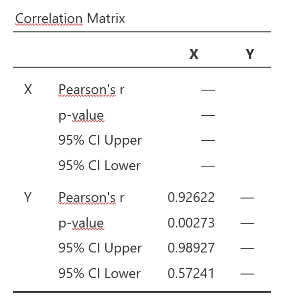
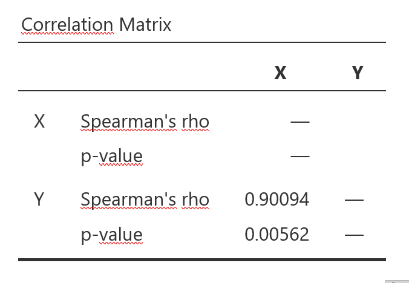

```{r setup-05, include=FALSE}
rm(list = ls())

knitr::opts_chunk$set(echo = FALSE, 
                      warning = FALSE, 
                      message = FALSE,
                      fig.align = "center",
                      fig.dim = c(5, 4))
library(openintro)
library(tidyverse)
library(knitr)
library(patchwork)
library(Hmisc)       # for errorbars in ggplot
library(kableExtra)
library(graphics)

ggred <- "#F8766D"
ggblue <- "#00BFC4"
ggreen <- "#7CAE00"
ggviolet <- "#C77CFF"

library(scales)
show_col(COL[1:20])
```

# Korrelation und linearer Zusammenhang

## Einleitung

In diesem Kapitel beschäftigen wir uns mit Zusammenhängen zwischen Variablen. Beispiele für Zusammenhänge von Variablen aus dem Alltag sind:  

- Je länger jemand joggt, desto grösser ist sein Kalorienverbrauch.  
- Je weniger Geld ich für die Werbung für meine Firma ausgebe, desto weniger Kunden habe ich.   
- Je höher die Aussentemperatur ist, desto mehr Eis verkaufen die Eisstände.  
- Je öfter es regnet, desto teurer werden die Regenschirmpreise.  
- Je mehr Zeit jemand ins Krafttraining investiert, desto stärker wird er.  
- Je schneller ein Zug fährt, desto kürzer wird die Reisezeit.   
- Je länger der Winter dauert, desto höher werden die Heizkosten.  

Den linearen Zusammenhang zwischen zwei Variablen bezeichnen wir als **Korrelation**. Wenn man die Beziehung zwischen zwei Variablen kennt, können wir den Wert der einen Variablen verwenden um den Wert der anderen Variablen vorherzusagen.    

## Lernziele

1. Beschreibe die Eigenschaften des Zusammenhangs von zwei Variablen mit folgenden Begriffen   
   a) Richtung: Ein *positiver Zusammenhang* besteht dann, wenn sich bei einer Erhöhung von x auch y erhöht; wenn sich bei einer Erniedrigung von x der Wert von y erhöht, sprechen wir von einem *negativen Zusammenhang*.   
   b) Form: Ein Zusammenhang ist *linear* oder *nicht-linear*  
   c) Stärke: Ein Zusammenhang ist *stark*, wenn die Streuung der Daten um die zugrundeliegende Beziehung gering ist und *schwach*, wenn die Streuung der Daten gross ist.  
2. Definiere eine Korrelation als *lineare* Beziehung zwischen zwei quantitativen Variablen.  
3. Beachte, dass der Korrelationskoeffizient $r$ folgende Eigenschaften aufweist:  
   a) der (absolute) Wert des Korrelationskoeffizienten misst die Stärke der linearen Beziehung zwischen zwei quantitativen Variablen.  
   b) das Vorzeichen (+ oder -) des Korrelationskoeffizienten beschreibt die Richtung des Zusammenhangs.  
   c) der Korrelationskoeffizient liegt immer zwischen -1 und 1. -1 bedeutet perfekter negativer linearer Zusammenhang, + 1 bedeutet perfekter positiver linearer Zusammenhang und 0 bedeutet kein linearer Zusammenhang.   
   d) der Korrelationskoeffizient ist dimensionslos.  
   e) der Korrelationskoeffizient von X mit Y ist der selbe wie von Y zu X.   
   f) der Korrelationskoeffizient nach Pearson $r$ ist empfindlich für Ausreisser.   
   g) Der Rangkorrelationskoeffizient nach Spearman $r_s$ misst den monotonen Zusammenhang und ist robust gegen Ausreisser.   
4. Korrelation bedeutet nicht, dass ein ursächlicher Zusammenhang besteht! *Correlation does not imply causation!*  

## Korrelation

Eine Korrelation beschreibt eine Beziehung zwischen zwei oder mehreren quantitativen Merkmalen (Variablen). Dabei muss diese Beziehung nicht kausal sein, d.h. die Variablen müssen sich nicht gegenseitig beeinflussen und der Zusammenhang kann völlig zufällig sein.

Beispiel: Gibt es einen Zusammenhang zwischen der Laufgeschwindigkeit und dem Kalorienverbrauch pro Stunde? Wir verwenden die Stichprobendaten von $n$ = 11 durchschnittlich 59 kg schweren Läuferinnen:

```{r running-tab}
# dataset from https://www.kaggle.com/aadhavvignesh/calories-burned-during-exercise-and-activities
running <- read_csv("./data/05_running2.csv")

running %>% 
  select(kmh, kg59) %>% 
  kable(col.names = c("km/h  ", "kCal/h"), align = "c", 
        caption = "11 Läuferinnen") %>% 
  kable_classic(bootstrap_options = "striped", full_width = FALSE, position = "center")
```

Der Tabelle entnehmen wir, dass mit zunehmender Laufgeschwindigkeit auch der Kalorienverbrauch zunimmt. Zusammenhänge zwischen zwei quantitativen Variablen können gut mit Hilfe eines Streudiagramms (engl. scatterplot) visualisiert werden.

```{r running-scatp-fig, fig.align='center', fig.dim=c(6, 5), fig.cap="Kalorienverbrauch nach Laufgeschwindigkeit, n = 11"}
ggplot(running, aes(x = kmh, y = kg59)) +
  geom_smooth(method = "lm", se = FALSE, color = "black") +
  geom_point(color = COL[1], size = 4, alpha = .7) +
  xlab("Geschwindigkeit (km/h)") +
  ylab("Kalorienverbrauch (kCal/h)") +
  # ggtitle("Running: Kalorienverbrauch einer 59 kg schweren Person") +
  theme_grey()
```

Jeder Punkt im Streudiagramm \@rer(fig:running-scatp-fig) repräsentiert eine Kombination von Geschwindigkeit (x-Achse) und Kalorienverbrauch (y-Achse). Wenn wir die Punkte visuell miteinander verbinden, entsteht eine - nicht ganz perfekte - Gerade. In diesem Fall sprechen wir von einem *linearen* Zusammenhang.   

### Eigenschaften von Zusammenhängen

Die folgenden acht Punktdiagramme zeigen verschiedene Zusammenhänge zwischen der X- und der Y-Variablen.  

```{r relationshipsR-fig, fig.dim=c(8, 5), fig.align='center', fig.cap="Zusammenhänge identifizieren"}
# https://github.com/OpenIntroStat/openintro-statistics/blob/master/ch_regr_simple_linear/figures/eoce/identify_relationships_1/identify_relationships_1.R
set.seed(9274)

x1 <- seq(0, 6, by = 0.05)

y_u <- (x1-3)^2 - 4 + rnorm(length(x1), mean = 0, sd = 1)
y_lin_pos_strong <- 3*x1 + 10 + rnorm(length(x1), mean = 0, sd = 2)
y_lin_pos_weak <- 3*x1 + 10 + rnorm(length(x1), mean = 0, sd = 20)


x2 <- seq(-8, -2, by = 0.05)

y_n <- -1 * (x2 + 5)^2 + 1 + rnorm(length(x2), mean = 0, sd = 2)
y_lin_neg_strong <- -5 * x2 + 3 + rnorm(length(x2), mean = 0, sd = 2)
y_none <- rnorm(length(x2), mean = 0, sd = 1)


scat <- tibble(
  x1, y_u, y_lin_pos_strong, y_lin_pos_weak, 
  x2, y_n, y_lin_neg_strong, y_none
)


# plot u-shaped -----------------------------------------------------
r <- round(cor(scat$x1, scat$y_u), 3)

scat1 <- ggplot(scat, aes(x = x1, y = y_u)) +
  geom_point(color = COL[1], size = 2, alpha = .7) +
  xlab("(a)") +
  ylab("") +
  ggtitle(paste("r =", r)) +
  theme_grey()

# plot linear positive strong ---------------------------------------
r <- round(cor(scat$x1, scat$y_lin_pos_strong), 3)

scat2 <- ggplot(scat, aes(x = x1, y = y_lin_pos_strong)) +
  geom_point(color = COL[1], size = 2, alpha = .7) +
  xlab("(c)") +
  ylab("") +
  ggtitle(paste("r =", r)) +
  theme_grey()

# plot linear positive weak -----------------------------------------
r <- round(cor(scat$x1, scat$y_lin_pos_weak), 3)

scat3 <- ggplot(scat, aes(x = x1, y = y_lin_pos_weak)) +
  geom_point(color = COL[1], size = 2, alpha = .7) +
  xlab("(d)") +
  ylab("") +
  ggtitle(paste("r =", r)) +
  theme_grey()

# plot n-shaped -----------------------------------------------------
r <- round(cor(scat$x2, scat$y_n), 3)

scat4 <- ggplot(scat, aes(x = x2, y = y_n)) +
  geom_point(color = COL[1], size = 2, alpha = .7) +
  xlab("(e)") +
  ylab("") +
  ggtitle(paste("r =", r)) +
  theme_grey()

# plot lin-neg-strong -----------------------------------------------------
r <- round(cor(scat$x2, scat$y_lin_neg_strong), 3)

scat5 <- ggplot(scat, aes(x = x2, y = y_lin_neg_strong)) +
  geom_point(color = COL[1], size = 2, alpha = .7) +
  xlab("(g)") +
  ylab("") +
  ggtitle(paste("r =", r)) +
  theme_grey()

# plot no relationship ----------------------------------------------
r <- round(cor(scat$x2, scat$y_none), 3)

scat6 <- ggplot(scat, aes(x = x2, y = y_none)) +
  geom_point(color = COL[1], size = 2, alpha = .7) +
  xlab("(h)") +
  ylab("") +
  ggtitle(paste("r =", r)) +
  theme_grey()

# plot r = 1 ----------------------------------------------
x <- runif(30, min = 0, max = 5)
lin_pos_y <- 10 + 0.8 * x
lin_neg_y <- 10 - 0.8 * x

lin_scatr <- tibble(
  x = x,
  y_pos = lin_pos_y,
  y_neg = lin_neg_y
)

r <- round(cor(lin_scatr$x, lin_scatr$y_pos), 3)
scat7 <- ggplot(lin_scatr, aes(x = x, y = y_pos)) +
  geom_point(color = COL[1], size = 2, alpha = .7) +
  xlab("(b)") +
  ylab("") +
  ggtitle(paste("r =", r)) +
  theme_grey()

# plot r = -1 ----------------------------------------------
r <- round(cor(lin_scatr$x, lin_scatr$y_neg), 3)
scat8 <- ggplot(lin_scatr, aes(x = x, y = y_neg)) +
  geom_point(color = COL[1], size = 2, alpha = .7) +
  xlab("(f)") +
  ylab("") +
  ggtitle(paste("r =", r)) +
  theme_grey()


(scat1 | scat7 | scat2 |scat3) /
  (scat4 | scat8 | scat5 | scat6)
```

Interpretation:  

(a) Starker nicht-linearer Zusammenhang zwischen X und Y.   
(b) Perfekter positiver linearer Zusammenhang zwischen X und Y.   
(c) Starker positiver linearer Zusammenhang zwischen X und Y: 
    - Wenn X grösser wird, wird auch Y grösser: positiver Zusammenhang.  
    - Die Punkte liegen etwa parallel zu einer gedachten Geraden: linearer Zusammenhang.  
    - Die Punkte streuen wenig um eine gedachte Linie: starker Zusammenhang.   
(d) Schwacher positiver linearer Zusammenhang, die Punkte streuen stark.   
(e) Moderater Zusammenhang zwischen X und Y, der Zusammenhang ist nicht-linear.   
(f) Perfekter negativer linearer Zusammenhang.   
(g) Starker negativer linearer Zusammenhang:  
    - Wenn X grösser wird, wird Y kleiner: negativer Zusammenhang  
    - Die Punkte liegen nahe bei einer gedachten Gerade: starker linearer Zusammenhang.  
(h) Kein Zusammenhang zwischen X und Y.   

### Korrelationskoeffizient $r$  

Der **Korrelationskoeffizient nach Pearson** $r$ ist ein Mass dafür, wie stark der lineare Zusammenhang zwischen zwei Variablen ist. Stehen zwei Variablen miteinander in Zusammenhang, kann man Aussagen darüber treffen, wie sich die Werte der einen Variable verhalten, wenn die Werte der anderen Variable ansteigen oder abfallen. 

**Interpretation von $r$**      

- Der Korrelationskoeffizient $r$ kann Werte zwischen -1 und 1 annehmen. Je näher $r$ bei 1 (bzw. bei -1) liegt, desto stärker ist der Zusammenhang der Variablen. Bei $r$ = 1 liegen alle Punkte der Daten auf einer steigenden Geraden; entsprechend bei -1 auf einer fallenden Geraden.     
- $r > 0$: Ist der Korrelationskoeffizient grösser als null, liegt eine positive Korrelation vor: Je grösser die Werte der einen Variablen, desto grösser sind die Werte der anderen Variablen.  
- $r < 0$: Ist der Korrelationskoeffizient kleiner als null, liegt eine negative Korrelation vor: Je grösser die Werte der einen Variablen, desto kleiner sind die Werte der anderen Variablen.   
- $r \approx 0$: Liegt der Korrelationskoeffizient nahe 0, gibt es keinen linearen Zusammenhang zwischen den Variablen. Es ist keine Aussage darüber möglich, wie sich die Werte der einen Variablen verändern, wenn die Werte der anderen Variablen steigen oder sinken.   
- Beachte, dass der Korrelationskoeffizient nur lineare Zusammenhänge abbildet. Es kann sein, dass die Variablen zusammenhängen, nur eben nicht linear, z.B. quadratisch oder exponentiell. Ein Korrelationskoeffizient nahe bei 0 bedeutet daher nicht, dass überhaupt kein Zusammenhang besteht. Es bedeutet nur, dass kein linearer Zusammenhang besteht.  

Als Faustregel für die Beurteilung der Stärke einer Korrelation kann man sich an folgender Tabelle orientieren:

| Korrelation  | Stärke | Richtung |
|:-:|:-:|:-:|
|-1.0 to -0.8 | stark | Negativ |
|-0.8 to -0.5 | moderat | Negativ |
|-0.5 to 0 | schwach | Negativ |
|0 to 0.5 | schwach | Positiv |
|0.5 to 0.8 | moderat | Positiv |
|0.8 to 1.0 | stark | Positiv |   

### Berechnung von $r$   

Die Details zur Berechnung des Korrelationskoeffizienten ersparen wir uns. Das übernimmt die Statistiksoftware.

Die Funktion in `R` [@R-base] für die Berechnung des Korrelationskoeffizienten ist  

```{r, echo=TRUE, eval=FALSE}
### R-Code

# Korrelationskoeffizient nach Pearson   
cor(x, y)        
```

### Hypothesentest für $r$   

Auch für den Korrelationskoeffizienten exisitiert ein Hypothesentest. Wie bei jedem Hypothesentest wird auch hier aus Stichprobendaten auf die Population, aus der die Stichprobe stammt, geschlossen. Für den Korrelationskoeffizienten nach Pearson $r$ lauten die Hypothesen:   

$H_0: \rho = 0$ Es besteht kein linearer Zusammenhang zwischen zwei Variablen.   
$H_A: \rho \neq 0$ Es besteht ein linearer Zusammenhnag zwischen zwei Variablen. 

$\rho$ (gr. Rho) ist der Korrelationskoeffizient auf Populationsebene.   

Die Funktion in `R` für diesen Hypothesentest ist 

```{r, echo=TRUE, eval=FALSE}
### R-Code

# Hypothesentest für r
cor.test(x, y)
```

### Interpretation des Beispiels für Laufgeschwindigkeit und Kalorienverbrauch  


```{r running-PearsonR-fig, fig.align='center', fig.width=6, fig.cap="Zusammenhang von Kalorienverbrauch und Laufgeschwindigkeit"}
r <- round(cor(running$kmh, running$kg59), 3)

ggplot(running, aes(x = kmh, y = kg59)) +
  geom_point(color = COL[1], size = 3) +
  geom_smooth(method = "lm", se = FALSE, color = "darkgrey") +
  xlab("Geschwindigkeit (km/h)") +
  ylab("Kalorienverbrauch (kCal/h)") +
  ggtitle(paste("r =", r)) +
  theme_grey()
```

Wir sehen, dass eine sehr starke positive lineare Korrelation zwischen der Laufgeschwindigkeit und dem Kalorienverbrauch besteht. Der Korrelationskoeffizient nach Pearson $r$ ist 0.997. 

```{r, echo=TRUE}
### R-Code

cor.test(running$kmh, running$kg59)
```

Der Hypothesentest in `R`ergibt einen p-Wert von $3.082 \times 10^{-11}$. Dies ist ein extrem kleiner p-Wert, der unter dem üblichen Signifikanzniveau von $\alpha = 0.05$ liegt. Wir schliessen daraus, dass wir die Nullhypothese zugunsten der Alternativhypothese verwerfen können und dass ein statistisch signifikanter Zusammenhang zwischen Laufgeschwindigkeit und Kalorienverbrauch besteht. 

*Die Stichprobendaten liefern Evidenz dafür, dass ein nahezu perfekter positiver linearer Zusammenhang zwischen Laufgeschwindigkeit und Kalorienverbrauch in der Population (59kg schwere Frauen) besteht, $r$ = 0.997 [0.988; 0.999], p < 0.001.*  

### Datenmuster und $r$

Korrelationskoeffizienten sind unter Forscher:innen beliebt, weil sie den Zusammenhang zwischen zwei Variablen in einer einzigen Zahl zusammenfassen. Allerdings kann ein bestimmter Korrelationskoeffizient eine Vielzahl von Mustern zwischen zwei Variablen repräsentieren und ohne zusätzliche Information - idealerweise in Form eines Streudiagramms - wissen weder die Forscher:innen noch die Leser:innen, um welche Art von Zusammenhang es sich handelt.  

Die folgenden 16 Streudiagramme zeigen, was sich alles hinter einem Korrelationskoeffizienten von $r = 0.8$ (n = 50) verbergen kann. (Quelle und Erläuterungen: https://janhove.github.io/teaching/2016/11/21/what-correlations-look-like) 

```{r}
# plot_r
# 
# Given a correlation coefficient and a sample size, 
# this function draws 16 scatterplots
# whose shapes differ greatly 
# but all of which are consistent with the correlation coefficient.
#
# jan.vanhove@unifr.ch
# http://janhove.github.io
#
# Last change: 19 November 2016

plot_r <- function(r = 0.6, n = 50, showdata = FALSE) {
  
  # Function for computing y vector.
  # Largely copy-pasted from
  # http://stats.stackexchange.com/questions/15011/generate-a-random-variable-with-a-defined-correlation-to-an-existing-variable/15040#15040
  
  compute.y <- function(x, y, r) {
    theta <- acos(r)
    X     <- cbind(x, y)                              # matrix
    Xctr  <- scale(X, center = TRUE, scale = FALSE)   # centered columns (mean 0)
    
    Id   <- diag(n)                                   # identity matrix
    Q    <- qr.Q(qr(Xctr[, 1, drop = FALSE]))         # QR-decomposition, just matrix Q
    P    <- tcrossprod(Q)          # = Q Q'           # projection onto space defined by x1
    x2o  <- (Id - P) %*% Xctr[, 2]                    # x2ctr made orthogonal to x1ctr
    Xc2  <- cbind(Xctr[, 1], x2o)                     # bind to matrix
    Y    <- Xc2 %*% diag(1 / sqrt(colSums(Xc2 ^ 2)))  # scale columns to length 1
    
    y <- Y[, 2] + (1 / tan(theta)) * Y[, 1]     # final new vector
    return(y)
  }
  
  
  # Graph settings
  op <- par(no.readonly = TRUE)
  par(
    las = 1,
    mfrow = c(4, 4),
    xaxt = "n",
    yaxt = "n",
    mar = c(1, 1.5, 2, 1.5),
    oma = c(0, 0, 3.5, 0),
    cex.main = 1.1
  )
  
  # Case 1: Textbook case with normal x distribution and normally distributed residuals
  x <- rnorm(n)           # specify x distribution
  y <- rnorm(n)           # specify y distribution
  y <- compute.y(x, y, r) # recompute y to fit with x and r
  plot(                   # plot
    x,
    y,
    ylab = "",
    xlab = "",
    main = paste("(1) Normal x, normal residuals", sep = "")
  )
  abline(lm(y ~ x), col = "dodgerblue3")
  df1 <- data.frame(x, y) # store x and y to data frame
 
  
  # Case 2: Textbook case with uniform x distribution and normally distributed residuals
  x <- runif(n, 0, 1)
  y <- rnorm(n)
  y <- compute.y(x, y, r)
  plot(
    x,
    y,
    ylab = "",
    xlab = "",
    main = paste("(2) Uniform x, normal residuals", sep = "")
  )
  abline(lm(y ~ x), col = "dodgerblue3")
  df2 <- data.frame(x, y)
  
  # Case 3: Skewed x distribution (positive): A couple of outliers could have high leverage.
  x <- rlnorm(n, 5)
  y <- rnorm(n)
  y <- compute.y(x, y, r)
  plot(
    x,
    y,
    ylab = "",
    xlab = "",
    main = paste("(3) +-skewed x, normal residuals", sep = "")
  )
  abline(lm(y ~ x), col = "dodgerblue3")
  df3 <- data.frame(x, y)
  
  # Case 4: Skewed x distribution (negative): Same as 4.
  x <- rlnorm(n, 5) * -1 + 5000
  y <- rnorm(n)
  y <- compute.y(x, y, r)
  plot(
    x,
    y,
    ylab = "",
    xlab = "",
    main = paste("(4) --skewed x, normal residuals", sep = "")
  )
  abline(lm(y ~ x), col = "dodgerblue3")
  df4 <- data.frame(x, y)
  
  # Case 5: Skewed residual distribution (positive), similar to 3-4
  x <- rnorm(n)
  y <- rlnorm(n, 5)
  y <- compute.y(x, y, r)
  plot(
    x,
    y,
    ylab = "",
    xlab = "",
    main = paste("(5) Normal x, +-skewed residuals", sep = "")
  )
  abline(lm(y ~ x), col = "dodgerblue3")
  df5 <- data.frame(x, y)
  
  # Case 6: Skewed residual distribution (negative), same as 5
  x <- rnorm(n)
  y <- rlnorm(n, 5)
  y <- y * -1
  y <- compute.y(x, y, r)
  plot(
    x,
    y,
    ylab = "",
    xlab = "",
    main = paste("(6) Normal x, --skewed residuals", sep = "")
  )
  abline(lm(y ~ x), col = "dodgerblue3")
  df6 <- data.frame(x, y)
  
  # Case 7: Variance increases with x. Correlation coefficient under/oversells predictive power depending on scenario.
  # Also, significance may be affected.
  x <- rnorm(n)
  x <- sort(x, decreasing = FALSE) + abs(min(x))
  variance <- 10*x # spread increases with x
  y <- rnorm(n, 0, sqrt(variance)) # error term has larger variance with x
  y <- compute.y(x, y, r)
  plot(
    x,
    y,
    ylab = "",
    xlab = "",
    main = paste("(7) Increasing spread", sep = "")
  )
  abline(lm(y ~ x), col = "dodgerblue3")
  df7 <- data.frame(x, y)
  
  # Case 8: Same as 7, but variance decreases with x
  x <- rnorm(n)
  x <- x + abs(min(x))
  a <- 10 * (max(x)) # calculate intercept of x-standard deviation function
  variance <- a - 10*x
  y <- rnorm(n, 0, sqrt(variance))
  y <- compute.y(x, y, r)
  plot(
    x,
    y,
    ylab = "",
    xlab = "",
    main = paste("(8) Decreasing spread", sep = "")
  )
  abline(lm(y ~ x), col = "dodgerblue3")
  df8 <- data.frame(x, y)
  
  # Case 9: Nonlinearity (quadratic trend).
  x <- rnorm(n)
  y <- x ^ 2 + rnorm(n, sd = 0.2)
  y <- compute.y(x, y, r)
  plot(
    x,
    y,
    ylab = "",
    xlab = "",
    main = paste("(9) Quadratic trend", sep = "")
  )
  abline(lm(y ~ x), col = "dodgerblue3")
  df9 <- data.frame(x, y)
  
  # Case 10: Sinusoid relationship
  x <- runif(n,-2 * pi, 2 * pi)
  y <- sin(x) + rnorm(n, sd = 0.2)
  y <- compute.y(x, y, r)
  plot(
    x,
    y,
    ylab = "",
    xlab = "",
    main = paste("(10) Sinusoid relationship", sep = "")
  )
  abline(lm(y ~ x), col = "dodgerblue3")
  df10 <- data.frame(x, y)
  
  # Case 11: A single positive outlier can skew the results.
  x <- rnorm(n - 1)
  x <- c(sort(x), 10)
  y <- c(rnorm(n - 1), 15)
  y <- compute.y(x, y, r)
  plot(
    x,
    y,
    ylab = "",
    xlab = "",
    main = paste("(11) A single positive outlier", sep = "")
  )
  abline(lm(y ~ x), col = "dodgerblue3")
  df11 <- data.frame(x, y)
  
  # Regression without outlier
  group1 <- x[1:(n - 1)]
  y1 <- y[1:(n - 1)]
  
  xseg1 <- seq(
    from = min(group1),
    to = max(group1),
    length.out = 50
  )
  pred1 <- predict(lm(y1 ~ group1), newdata = data.frame(group1 = xseg1))
  lines(xseg1, pred1, lty = 2, col = "firebrick2")
  
  # Case 12: A single negative outlier - same as 11 but the other way.
  x <- rnorm(n - 1)
  x <- c(sort(x), 10)
  y <- c(rnorm(n - 1),-15)
  y <- compute.y(x, y, r)
  plot(
    x,
    y,
    ylab = "",
    xlab = "",
    main = paste("(12) A single negative outlier", sep = "")
  )
  abline(lm(y ~ x), col = "dodgerblue3")
  df12 <- data.frame(x, y)
  
  # Regression line without outlier
  group1 <- x[1:(n - 1)]
  y1 <- y[1:(n - 1)]
  
  xseg1 <- seq(
    from = min(group1),
    to = max(group1),
    length.out = 50
  )
  pred1 <- predict(lm(y1 ~ group1), newdata = data.frame(group1 = xseg1))
  lines(xseg1, pred1, lty = 2, col = "firebrick2")
  
  # Case 13: Bimodal y: Actually two groups (e.g. control and experimental). Better to model them in multiple regression model.
  x <- rnorm(n)
  y <- c(rnorm(floor(n / 2), mean = -3), rnorm(ceiling(n / 2), 3))
  y <- compute.y(x, y, r)
  plot(
    x,
    y,
    ylab = "",
    xlab = "",
    main = paste("(13) Bimodal residuals", sep = "")
  )
  abline(lm(y ~ x), col = "dodgerblue3")
  df13 <- data.frame(x, y)
  
  # Case 14: Two groups
  # Create two groups within each of which
  # the residual XY relationship is contrary to the overall relationship.
  # This will often produce examples of Simpson's paradox.
  x <- c(rnorm(floor(n / 2),-3), rnorm(ceiling(n / 2), 3))
  y <- -sign(r)* 10 * x + rnorm(n, sd = 0.5) + c(rep(0, floor(n / 2)), rep(3 * sign(r), ceiling(n / 2)))   
  
  # Symbols / colours for each group
  colour <- c(rep("blue", floor(n / 2)), rep("red", ceiling(n / 2)))
  symbol <- c(rep(1, floor(n / 2)), rep(4, ceiling(n / 2)))
  
  y <- compute.y(x, y, r)
  
  plot(
    x,
    y,
    ylab = "",
    xlab = "",
    pch = symbol,
    main = paste("(14) Two groups", sep = "")
  )
  abline(lm(y ~ x), col = "dodgerblue3")
  df14 <- data.frame(x, y)
  
  # Also add lines of regression within each group
  
  # Divide up y variable
  group1 <- x[colour == "blue"]
  group2 <- x[colour == "red"]
  y1 <- y[colour == "blue"]
  y2 <- y[colour == "red"]
  
  xseg1 <- seq(
    from = min(group1),
    to = max(group1),
    length.out = 50
  )
  pred1 <- predict(lm(y1 ~ group1), newdata = data.frame(group1 = xseg1))
  lines(xseg1, pred1, lty = 2, col = "firebrick2")
  
  xseg2 <- seq(
    from = min(group2),
    to = max(group2),
    length.out = 50
  )
  pred2 <- predict(lm(y2 ~ group2), newdata = data.frame(group2 = xseg2))
  lines(xseg2, pred2, lty = 2, col = "firebrick2")
  
  # Case 15: Sampling at the extremes - this would overestimate correlation coefficient based on all data.
  x <- sort(rnorm(6 * n, sd = 3))
  x1 <- x[1:floor((n / 2))]
  x2 <- x[floor(5.5 * n + 1):(6 * n)]
  x <- c(x1, x2)
  y <- rnorm(n)
  y <- compute.y(x, y, r)
  plot(
    x,
    y,
    ylab = "",
    xlab = "",
    main = paste("(15) Sampling at the extremes", sep = "")
  )
  abline(lm(y ~ x), col = "dodgerblue3")
  df15 <- data.frame(x, y)
  
  # Case 16: Lumpy x/y data, as one would observe for questionnaire items
  x <- sample(1:5, n, replace = TRUE, prob = sample(c(5, 4, 3, 2, 1))) # unequal proportions for each answer just for kicks
  y <- sample(1:7, n, replace = TRUE)
  y <- compute.y(x, y, r)
  plot(
    x,
    y,
    ylab = "",
    xlab = "",
    main = paste("(16) Coarse data", sep = "")
  )
  abline(lm(y ~ x), col = "dodgerblue3")
  df16 <- data.frame(x, y)
  
  # Overall title
  title(
    paste("All correlations: r(", n, ") = ", r, sep = ""),
    outer = TRUE,
    cex.main = 2
  )
  par(op)
  
  # Define data frame with numeric output
  df <- list(plot = 1:16, data = list(df1, df2, df3, df4,
                                     df5, df6, df7, df8,
                                     df9, df10, df11, df12,
                                     df13, df14, df15, df16))
  df <- structure(df, class = c("tbl_df", "data.frame"), row.names = 1:16)
  
  # Show numeric output depending on setting
  if(!(showdata %in% c(NULL, TRUE, FALSE, 1:16, "all"))) {
    warning("'showdata' must be TRUE, FALSE, 'all', or a number between 1 and 16.")
  } else if(showdata %in% c(TRUE, "all")) {
    return(df)
  } else if(showdata %in% 1:16) {
    return(df$data[[showdata]])
  }
}
```

```{r relationship-16-fig, fig.dim=c(8, 8), fig.cap="16 Varianten von Zusammenhängen, alle $r$ = 0.8"}
plot_r(r = .8, n = 50)
```

Ohne im einzelnen auf die Streudiagramme in Abbildung \@ref(fig:relationship-16-fig) einzugehen, ist leicht zu erkennen, dass ganz unterschiedliche Muster des Zusammenhangs zwischen zwei Variablen mit dem gleichen Korrelationskoeffizienten $r$ vorhanden sein können.

Betrachten wir das Beispiel 12 aus der Abbildung \@ref(fig:relationship-16-fig) etwas genauer: 

```{r cor-outlier-fig, fig.align='center', fig.dim=c(5, 5), fig.cap="Einfluss eines Ausreissers auf $r$"}
compute.y <- function(x, y, r) {
    theta <- acos(r)
    X     <- cbind(x, y)                              # matrix
    Xctr  <- scale(X, center = TRUE, scale = FALSE)   # centered columns (mean 0)
    
    Id   <- diag(n)                                   # identity matrix
    Q    <- qr.Q(qr(Xctr[, 1, drop = FALSE]))         # QR-decomposition, just matrix Q
    P    <- tcrossprod(Q)          # = Q Q'           # projection onto space defined by x1
    x2o  <- (Id - P) %*% Xctr[, 2]                    # x2ctr made orthogonal to x1ctr
    Xc2  <- cbind(Xctr[, 1], x2o)                     # bind to matrix
    Y    <- Xc2 %*% diag(1 / sqrt(colSums(Xc2 ^ 2)))  # scale columns to length 1
    
    y <- Y[, 2] + (1 / tan(theta)) * Y[, 1]     # final new vector
    return(y)
  }
  
 # Case 12: A single negative outlier - same as 11 but the other way.
r <- 0.8  # LS Korrelationskoeffizient = 0.8
n <- 50   # LS n = 50
set.seed(3)

  x <- rnorm(n - 1)
  x <- c(sort(x), 10)
  y <- c(rnorm(n - 1),-15)
  y <- compute.y(x, y, r)
  plot(
    x,
    y,
    ylab = "",
    xlab = "",
    main = paste("(12) A single negative outlier", sep = "")
  )
  abline(lm(y ~ x), col = "dodgerblue3")
  df12 <- data.frame(x, y)
  
  # Regression line without outlier
  group1 <- x[1:(n - 1)]
  y1 <- y[1:(n - 1)]
  
  xseg1 <- seq(
    from = min(group1),
    to = max(group1),
    length.out = 50
  )
  pred1 <- predict(lm(y1 ~ group1), newdata = data.frame(group1 = xseg1))
  lines(xseg1, pred1, lty = 1, col = "red")
  
cordata <- tibble(x, y)
cordata_noOutlier <- cordata %>% 
  filter(x < 10)
cor_noOutlier <- round(cor(cordata_noOutlier$x, cordata_noOutlier$y), 3)

# plot beschriften
text(x=1, y=0.5, labels="r = 0.925", col = "red")
text(x=6, y=0.5, labels="r = 0.8", col = "dodgerblue3")

# cor_noOutlier
# cor(x, y, method = "spearman")
```

Wir sehen links zwischen x = -2 und x = 2.8 eine Punktewolke, die einen starken positiven linearen Zusammenhang zwischen x und y zeigt. Bei x = 10, y = 6.2 befindet sich ein Ausreisser. Der Korrelationskoeffizient für alle Daten beträgt $r = 0.8$. Wenn wir den Ausreisser entfernen, erhöht sich der Korrelationskoeffizient auf $r = 0.925$, was vermutlich eher dem wahren Zusammenhang zwischen den Variablen entspricht. Unsere Schlussfolgerung: *Der Korrelationskoeffizient nach Pearson $r$ ist empfindlich für Ausreisser!*

### Rangkorrelationskoeffizient nach Spearman

Der Rangkorrelationskoeffizient nach Spearman $r_s$ ist ähnlich wie der Korrelationskoeffizient nach Pearson $r$ eine Methode, um Zusammenhänge zwischen Variablen zu quantifizieren. Dabei handelt es sich um einen *nicht-parametrischen* Test, bei dem die Korrelation anhand zuvor vergebener Ränge berechnet wird. Der Vorteil des Rangkorrelationskoeffizienten nach Spearman ist, dass er *robust* gegen Ausreisser ist und - in gewissem Umfang - auch nicht-lineare Zusammenhänge beschreiben kann. Die Interpretation von $r_S$ ist genau gleich, wie für $r$.

Der Rangkorrelationskoeffizient nach Spearman $r_s$ quantifiziert den *monotonen* Zusammenhang der Variablen und nicht den linearen Zusammenhang. Monotoner Zusammenhang bedeutet, wenn X steigt, steigt Y in der Tendenz auch bzw. wenn X steigt, sinkt Y in der Tendenz.   

```{r monoton-fig, fig.align='center', fig.dim=c(7, 5), fig.cap="Zwei perfekte monotone Zusammenhänge"}
x <- seq(from = 0, to = 4, by = .1) 
y <- 20 - x^3  
r <- round(cor(x, y), 3)
rS <- cor(x, y, method = "spearman")
tib <- tibble(
  x = x,
  y = y
)
rs1 <- ggplot(tib, aes(x = x, y = y)) +
  geom_point(size = 3, color = COL[1], alpha = .5) +
  ggtitle(paste("r = ", r, "| rs = ", rS)) +
  xlab("") +
  ylab("") +
  theme_bw()

x <- seq(from = 0, to = 4, by = .05)
y <- x^exp(1.5) 
r <- round(cor(x, y), 3)
rS <- cor(x, y, method = "spearman")
tib <- tibble(
  x = x,
  y = y
)
rs2 <- ggplot(tib, aes(x = x, y = y)) +
  geom_point(size = 3, color = COL[1], alpha = .5) +
  ggtitle(paste("r = ", r, "| rs = ", rS)) +
  xlab("") +
  ylab("") +
  theme_bw()

( rs1 | rs2)
```


Die Funktion in `R` für die Berechnung von $r_S$ ist

```{r, echo=TRUE, eval=FALSE}
### R-Code

# Rangkorrelationskoeffizient nach Spearman
cor(x, y, method = "spearman")
```

Die Berechnung von $r_s$ für das Beispiel 12 (alle Daten inkl. Ausreisser) ergibt $r_S = 0.938$. Der Wert von $r_s$ liegt nahe am Wert für $r = 0.925$ für die Daten ohne den Ausreisser. 

### Scheinkorrelationen

Das folgende Beispiel soll zeigen, dass bei der Interpretation von Korrelationen Vorsicht geboten ist.   

Frage: Besteht ein Zusammenhang zwischen der Schuhgrösse und dem Einkommen?  

Wir überprüfen diese Frage anhand der Angaben einer Stichprobe von $n$ = 1000. Die Proband:innen wurden nach ihrer Schuhgrösse (nur ganze Grössen) und ihrem monatlichen Bruttoeinkommen befragt. 

```{r shoesizeSalary-fig, fig.cap="Einkommen nach Schuhgrösse, n = 1000"}
# https://gunhanb.github.io/blog/2016/12/06/confounding.html
# simulate data
set.seed(3)
shoe_m <- round(rnorm(500, mean = 42, sd = 2), 0)
shoe_f <- round(rnorm(500, mean = 37, sd = 2), 0) 
salary_m <- rnorm(500, mean = 11000, sd = 3000)
salary_f <- rnorm(500, mean = 5000, sd = 1500)

data <- tibble(
  sex = c(rep("m", times = 500), rep("f", times = 500)),
  size = c(shoe_m, shoe_f),
  salary = c(salary_m, salary_f)
) %>% 
  filter(size > 33 & size < 50)
# write_csv(data, file = "./data/05_shoesize.csv")

# calculate correlations
cor <- round(cor(data$size, data$salary), 3)
# cor.test(data$size, data$salary)

data_m <- data %>% 
  filter(sex == "m") 
cor_m <- round(cor(data_m$size, data_m$salary), 3)
# cor.test(data_m$size, data_m$salary)

data_f <- data %>% 
  filter(sex == "f") 
cor_f <- round(cor(data_f$size, data_f$salary), 3)
# cor.test(data_f$size, data_f$salary)

# plots
ggplot(data, aes(x = size, y = salary)) +
  geom_smooth(method = "lm", se = FALSE, color = "black") +
  geom_point(color = COL[1], size = 2, alpha = .5) +
  xlab("Schuhgrösse") +
  ylab("Einkommen in CHF/Monat") +
  ggtitle(paste("r =", cor, ", p < 0.001")) +
  theme_grey()
```

Die Analyse ergibt einen moderaten positiven linearen Zusammenhang zwischen der Schuhgrösse und dem monatlichen Einkommen; mit zunehmender Schuhgrösse nimmt auch das monatliche Bruttoeinkommen zu ($r$ = 0.609, p < 0.001).

Aber ist diese Schlussfolgerung auch korrekt oder haben wir etwas übersehen?  

Die Analyse der Daten nach Geschlecht getrennt ergibt folgendes Resultat:     

```{r shoesizeSalarySex-fig, fig.dim=c(6, 4), fig.cap="Einkommen nach Schuhgrösse"}
ggplot(data, aes(x = size, y = salary, color = sex)) +
  geom_point(size = 2, alpha = .6) +
  geom_smooth(method = "lm", se = FALSE) +
  xlab("Schuhgrösse") +
  ylab("Einkommen in CHF/Monat") +
  ggtitle(paste("Frauen: r =", cor_f, ", p = 0.179", "| Männer: r =", cor_m, ", p = 0.839")) +
  theme_grey()
```

Wenn wir die Daten nach Geschlecht getrennt analysieren, verschwindet der Effekt vollständig. Wir haben keine Evidenz mehr dafür, dass ein Zusammenhang zwischen Schuhgrösse und Einkommen besteht (Frauen $r$ = -0.061, p = 0.179; Männer $r$ = -0.009, p = 0.839). 

Wie können wir dieses Ergebnis interpretieren? Männer haben typischerweise eine grössere Schuhgrösse als Frauen. Zudem haben Männer im Durchschnitt - nach wie vor - ein höheres Einkommen als Frauen. Es ist demnach das Geschlecht, das einen Einfluss auf das Einkommen hat, denn wir wissen intuitiv, dass die Schuhgrösse definitiv nichts mit dem Einkommen zu tun haben kann. In diesem Fall sprechen wir von einer *Scheinkorrelation*, die einen Zusammenhang feststellt, wo - zumindest kausal - keiner vorhanden ist. Das Geschlecht ist im vorliegenden Fall ein *Störfaktor* (engl. confounder), der sowohl das Einkommen als auch die Schuhgrösse bestimmt.  

Unter Confounding versteht man eine systematische Verzerrung, hervorgerufen durch einen oder mehrere Störfaktoren, die mit beiden Variablen zusammenhängen und bei der Untersuchung nicht berücksichtigt werden.   

Weitere Beispiele für Scheinkorrelationen findet man in diesem [Video](https://youtu.be/gxSUqr3ouYA) unter diesem [Link](https://www.tylervigen.com/spurious-correlations).

## Zusammenfassung

- **Pearson’s Korrelationskoeffizient** ist für viele Dinge nützlich, hat aber den Nachteil, dass er nur die Stärke einer *linearen* Korrelation zwischen zwei Variablen messen kann. Mit anderen Worten misst er, in welchem Mass die Daten auf eine perfekte gerade Linie fallen. Er ist empfindlich gegenüber Ausreissern. 
- Für Variablen, deren Zusammenhang nicht linear ist (was man am besten an einem Streudiagramm beurteilt), eignet sich der **Rangkorrelationskoeffizient nach Spearman** besser. Er ist in der Lage, nicht-lineare Zusammenhänge zu messen und er ist robust gegen Ausreisser.   
- Aus den 16 Grafiken haben wir gelernt, dass ein Zusammenhang zwischen zwei Variablen immer zuerst visuell am Streudiagramm und erst in zweiter Linie anhand des Korrelationskoeffizienten beurteilt werden muss!   

## Korrelation in R/jamovi

### `R` Code und Output   

Pearsons's Korrelationskoeffizient

```{r rcode-pearson, echo=TRUE}
### R-Code

# Simulierte Daten
x <- c(-2, -1.5, -.5, 0, 1, 3, 4)
y <- c(5, 4.5, 6, 5.5, 6, 6.5, 7.5)

# Streudiagramm erstellen
plot(x, y)

# Pearson's Korrelationskoeffizient
cor(x, y)

# Hypothesentest für Pearson's Korrelationskoeffizient
cor.test(x, y)
```

Rangkorrelationskoeffizient nach Spearman

```{r rcode-spearman, echo=TRUE}
### R-Code

# Simulierte Daten
x <- c(-2, -1.5, -.5, 0, 1, 3, 4)
y <- c(5, 4.5, 6, 5.5, 6, 6.5, 7.5)

# Streudiagramm erstellen
plot(x, y)

# Rangkorrelationskoeffizient nach Spearman
cor(x, y, method = "spearman")

# Hypothesentest für Rangkorrelationskoeffizienten nach Spearman
cor.test(x, y, method = "spearman")
```

### `jamovi` Output 

`jamovi\..\Regression\Correlation Matrix` 

Pearson's Korrelationskoeffizient   

Im Menü unter `Additional Options` > `Report significance` und `Confidence intervals` wählen.  

{width=50%}

Rangkorrelationskoeffizient nach Spearman   

Im Menü unter `Correlation Coefficients` > `Spearman` und unter `Additional Options` > `Report significance` wählen. Es kann kein Vertrauensintervall für $r_s$ berechnet werden.  

{width=50%} 
