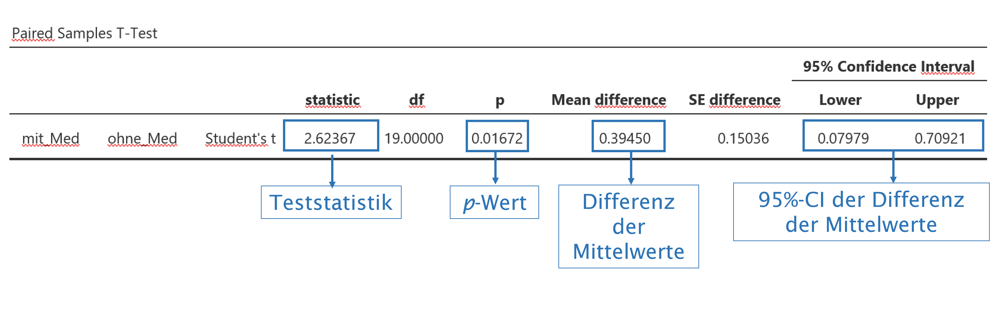
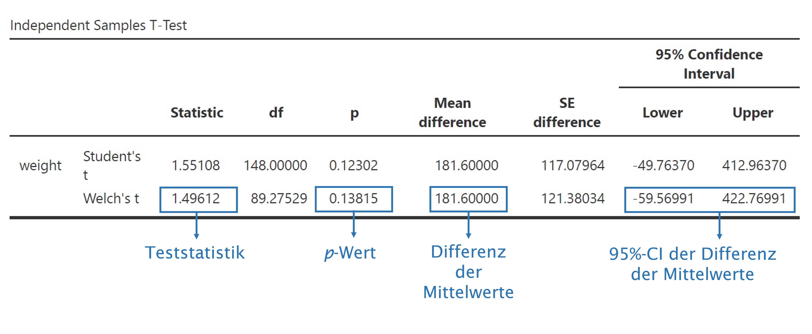
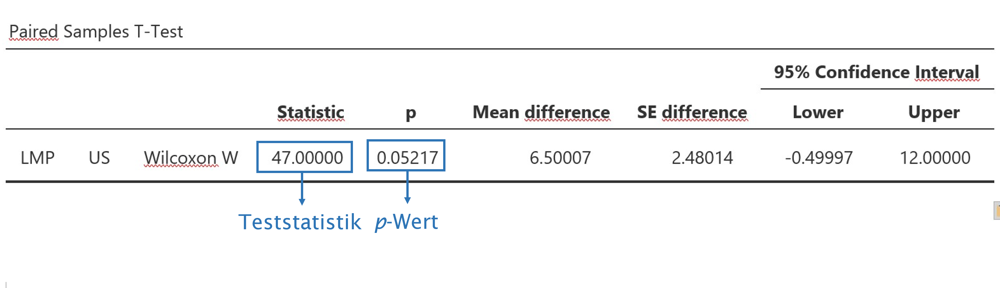

```{r setup-07, include=FALSE}
rm(list = ls())

knitr::opts_chunk$set(echo = FALSE, 
                      warning = FALSE, 
                      message = FALSE,
                      fig.align = "center",
                      fig.dim = c(5, 4))

library(openintro)
library(tidyverse)
library(knitr)
library(patchwork)
library(Hmisc)       # for errorbars in ggplot
library(kableExtra)
library(graphics)

ggred <- "#F8766D"
ggblue <- "#00BFC4"
ggreen <- "#7CAE00"
ggviolet <- "#C77CFF"

library(scales)
show_col(COL[1:20])
```

# Vergleich von Mittelwerten

> Dass die Sonne morgen aufgehen wird, ist eine Hypothese; und das heisst: wir *wissen* nicht, ob sie aufgehen wird.
>
> --- Ludwig Wittgenstein (Tractatus logico-philosophicus, 6.36311)


## Lernziele  

1. Identifiziere Daten als **gepaart bzw. verbunden**, wenn zu jeder Beobachtungseinheit zwei Messungen der gleichen Variable vorliegen. Beispiele sind Prä-Post-Messungen (Messwiederholungen) bei einer Interventionsstudie oder die Preise für ein Buch in verschiedenen Buchhandlungen.  

2. Berechne bei gepaarten Daten stets die **Differenz zwischen den Datenpaaren** (paarweise Differenzen). Dies ist die Prüfgrösse, mit der anschliessend statistische Tests durchgeführt werden können.  

3. Identifiziere Daten als **unabhängig**, wenn die Werte einer Stichprobe keine Informationen über die Werte der anderen Stichprobe enthalten. Dies ist z.B. bei kontrollierten Studien der Fall, bei denen Daten von Interventions- und Kontrollgruppen miteinander verglichen werden: Die Daten der Interventionsgruppe sind unabhängig von den Daten der Kontrollgruppe und enthalten keine Information über die Kontrollgruppe.  

4. Beachte, dass beim Vergleich der Differenz von zwei Parametern, die Interpretation von Vertrauensintervallen stets eine vergleichende Aussage beinhaltet; erwähne, welche Gruppe den grösseren Parameterwert hat.  

5. Verwerfe die Nullhypothese, wenn ein Vertrauensintervall für eine Differenz zwischen zwei Parametern den Wert 0 enthält.     

6. Verwende **nichtparametrische Testverfahren**, wenn der Stichprobenumfang klein ist (n < 30, Ausnahme gepaarter t-Test möglich ab n > 12) und/oder Hinweise vorliegen, dass die Populationsdaten nicht normal verteilt sind. 

7. Gehe bei Hypothesentests stets systematisch vor:  

  * Lege die Prüfgrösse und das Signifikanzniveau fest, formuliere die Hypothesen und berechne die Kennzahlen.  
  * Prüfe die Voraussetzungen (1) Unabhängigkeit der Daten, (2) Normalverteilung der Prüfgrösse und wähle je nach Ergebnis den richtigen [Test](https://rpubs.com/stammler/739797) aus.  
  * Berechne das Vertrauensintervall für die Prüfgrösse.  
  * Berechne die Teststatistik t (t-Test), W (Wilcoxon-Vorzeichen-Test) oder U (Mann-Whitney-U-Test) und den p-Wert.   
  * Formuliere eine Schlussfolgerung in leicht verständlicher Sprache.   


## T-Tests  

T-Tests sind *die* klassischen Hypothesentests. Sie gehören zur Gruppe der sog. *parametrischen* Tests. Damit parametrische Tests durchgeführt werden können, müssen die Daten in der annähernd normalverteilt sein. Wenn diese Voraussetzung nicht erfüllt ist, können alternativ *nicht-parametrische* Tests verwendet werden. Sie werden auch als *verteilungsfreie* Tests bezeichnet, da sie keine Annahme über die Verteilung der Daten voraussetzen. Nichtparametrische Tests sind in mehr Situationen zulässig als parametrische Tests.   

Warum sollen wir dann überhaupt parametrische Tests einsetzen? Parametrische Tests haben eine grössere Teststärke (Power) als nicht-parametrische Tests. Mit anderen Worten: Wenn tatsächlich ein Effekt in der Population vorliegt, haben parametrische Tests bessere Chancen, diesen Effekt auch nachzuweisen. Zudem prüfen nicht-parametrische Tests typischerweise eine etwas andere Nullhypothese als die parametrischen Tests.  

Im Zweifel gilt deshalb: *Wenn wir Evidenz für normalverteilte Daten haben, verwenden wir einen parametrischen Test. Wenn die Verteilung der Daten aber den Voraussetzungen eines parametrischen Tests widerspricht, weichen wir auf nichtparametrische Tests aus.*  

Nichtparametrische Testverfahren werden am Ende dieses Kapitels vorgestellt.

## T-Verteilung versus Normalverteilung  

Wie am Ende des Kapitels zu den Wahrscheinlichkeitsverteilungen beschrieben, verwenden Statistikprogramme für die Berechnung der Teststatistik die t-Verteilung und nicht die Normalverteilung, um Wahrscheinlichkeiten für Ereignisse zu bestimmen. Der Grund dafür ist u.a., dass die t-Verteilung für kleinere Stichproben (n < 30) zuverlässigere Resultate liefert. Alles was wir zur Interpretation von z-Werten gelernt haben, gilt auch für t-Werte: Wie die z-Werte zeigen auch die t-Werte, um wieviel Standardfehler die Stichprobenkennzahl vom Populationsparameter entfernt ist.  

## T-Test für eine einfache Stichprobe 

(Im folgenden Beispiel wird auch die Berechnung von Vertrauensintervallen für t-verteilte Daten besprochen. Der eigentliche T-Test ist der letzte Schritt 4.)

Beispiel: Werden Volksläufer über die Jahre eher schneller oder langsamer? Für die Bearbeitung diese Frage liegen die Daten des Cherryblossom-Volkslaufs der jeweils im Frühjahr in Washington, DC durchgeführt wird, vor. Die Laufstrecke ist 16.1 km (10 Meilen) lang [www.cherryblossom.org](https://www.cherryblossom.org/).  

Die durchschnittliche Laufzeit für alle Läufer:innen, die den Lauf 2006 beendet haben betrug 93.29 Minuten. Zum Vergleich liegt uns eine Zufallsstichprobe von 100 Läufer:innen vor, die am Lauf im Jahre 2012 teilgenommen haben (die Teilnehmerzahl betrug im Jahr 2012 16'924 Läufer:innen). Uns interessiert, ob die Läufer:innen zwischen 2006 und 2012 im Durchschnitt schneller oder langsamer geworden sind.   

### Vorgehen

**1. Hypothesen formulieren**  

Der Vergleichswert aus dem Jahr 2006 ist in diesem Fall der sog. *Nullwert*: $\mu_0 = 93.29$.   

$H_0: \mu_{2012} = 93.29$, es gibt keinen Unterschied in der durchschnittlichen Laufzeit zwischen 2006 und 2012.  
$H_A: \mu_{2012} \neq 93.39$, es gibt einen Unterschied in der durchschnittlichen Laufzeit zwischen 2006 und 2012.  

Ist das eine einseitige oder eine zweiseitige $H_A$?

**2. Test-Voraussetzungen prüfen**   

- Wir bestimmen Mittelwert und Standardabweichung und erstellen ein Histogramm für die Laufzeit.   

```{r run12-desc}
library(cherryblossom)
data(run12)

set.seed(0)
sample <- sample_n(run12, 100) 

# save dataset for jamovi
# write_csv(sample, file = "../Datasets/run12_100.csv")

sample %>% 
  summarise(
    n = n(), 
    m = mean(time),
    s = sd(time),
    Median = median(time)
  ) %>% 
  kbl(digits = 2, caption = "Cherryblossom-Run 2012, n = 100") %>%
  kable_classic(full_width = FALSE)
```

```{r run12-hist-fig, fig.cap="Cherryblossom-Run 2012: Laufzeiten für die Stichprobe n = 100"}
sample %>% 
  ggplot(., aes(x = time)) +
  geom_histogram(bins = 10, fill = COL[1], color = "white") +
  xlab("Zeit in Minuten") +
  ylab("Anzahl") +
  theme_grey()
```

- Unabhängigkeit: Eine Zufallsstichprobe von 100 aus 16924 ist kleiner als 10%, die Beobachtungseinheiten sind unabhängig.  
- Die Verteilung der Daten im Histogramm ist nahezu normal (evtl. etwas linkssteil). Mit welchen Verfahren könnten Sie zusätzlich auf Normalverteilung prüfen?   

```{r run12-qq-fig, fig.height = 4, fig.width = 5, fig.align='center', fig.cap="QQ-Plot fpr Cherryblossom-Run 2012, n = 100"}
ggplot(sample, aes(sample = time)) +
  stat_qq(color = COL[1], alpha = .7, size = 3) +
  stat_qq_line() +
  labs(
    x = "theoretisch",
    y = "Stichprobe"
  ) +
  theme_grey()
```

**3. Berechnung des 95%-Vertrauensintervalls für $\bar{x}$**  

$$SE = \frac{s}{\sqrt{n}} = \frac{16.66}{\sqrt{100}}=1.66$$

$$CI_{95} = \bar{x} \pm t_{df} \times SE$$

Wir verwenden hier für die Berechnung des 95%-Intervalls den t-Wert für die Anzahl Freiheitsgrade df = (100 - 1) = 99. Am einfachsten finden Sie den t-Wert mit dem [Internet-Rechner Students T-Verteilung](http://eswf.uni-koeln.de/glossar/surfstat/t.htm).

Die Berechnung in `R/jamovi`:

```{r normquantile_run, echo=TRUE}
### R-Code

# die Funktion qt() berechnet eine Quantile für eine bestimmte Fläche und 
# einen bestimmten Freiheitsgrad (s. unten)

qt(.975, df = 99)
```


```{r confint_run}
n <- 100
m <- 95.87
s <- 16.66
SE <- s/sqrt(n)
t <- qt(.975, df = 100-1)
CI95 <- m + c(-1, 1) * t * SE
CI95 <- round(CI95, 2)
```

Das 95%-Vertrauensintervall für die durchschnittliche Laufzeit 2012 ist [92.56; 99.18]. Es beinhaltet den Durchschnittswert von 2006 von 93.29 Minuten und wir haben keine Evidenz dafür, die Nullhypothese zu verwerfen.  

**4. Berechnung des p-Werts: Ein-Stichproben-T-Test**    

Die Berechnung des t-Werts erfolgt gleich wie für den z-Wert:  

$$t = \frac{\bar{x} - \mu_0}{SE}$$

```{r tvalue_run, echo=TRUE}
### R-Code

n <- 100                   # Stichprobenumfang der Stichprobe 2012
m <- 95.87                 # Stichprobenmittelwert 2012
s <- 16.66                 # Standardabweichung 2012
mu <- 93.29                # Nullwert 2006
SE <- s/sqrt(n)            # Standardfehler für den Stichprobenmittelwert 2012
t_wert <- (m - mu)/SE      # Berechnung des t-Werts
t_wert <- round(t_wert, 3) # t-wert auf drei Stellen runden
```

Der $t$-Wert für unsere Punktschätzung ist $t = 1.549$. Den p-Wert können wir wieder mit dem [Internet-Rechner Students T-Verteilung](http://eswf.uni-koeln.de/glossar/surfstat/t.htm) oder mit `R/jamovi` berechnen. 

```{r pvalue_run, echo=TRUE}
### R-Code

p_wert <- 2 * (1-pt(t_wert, df = 99)) # Berechnung p-Wert für eine zweiseitige Hypothese
p_wert <- round(p_wert, 3)            # berechneten p-Wert auf 3 Nachkommastellen runden
p_wert                                # berechneten p-Wert anzeigen
```

Ein $p$-Wert von $p$ = 0.125 bedeutet, dass unter der Annahme, dass $H_0$ wahr ist, ein Ergebnis wie in unserer Stichprobe oder ein noch extremeres Ergebnis mit einer Wahrscheinlichkeit von 12.5 % vorkommt. $p$ = 0.12 ist grösser als unser Signifikanzniveau $\alpha$ = 0.05 und wir verwerfen die $H_0$ nicht. 

**5. Schlussfolgerung formulieren**   

*Untersucht wurde die Frage, ob sich die durchschnittliche Laufzeit von Volksläufer:innen über die Jahre geändert hat. Als Nullwert wurde die durchschnittliche Laufzeit von 2006 von 93.29 Minuten angenommen. In einer Zufallsstichprobe n = 100 der Läufer:innen am Cherryblossom Run 2012 betrug die durchschnittliche Laufzeit 95.87 [92.56, 99.18] Minuten, $t(99)$ = 1.549, $p$ = 0.125. Die vorliegenden Daten liefern keine Evidenz dafür, dass sich die durchschnittlichen Laufzeiten zwischen 2006 und 2012 verändert haben.*

### Vertrauensintervall für einen Mittelwert Schritt-für-Schritt: 

1. Vorbereitung: Berechne den $\bar{x}$, $s$ und $n$ und lege das Vertrauensniveau fest (üblicherweise 95% = 0.95)   
2. Voraussetzungen: Prüfe, ob die Voraussetzungen erfüllt sind, dass die Daten aus einer Normalverteilung stammen (QQ-Plot).   
3. Berechnung: Wenn die Voraussetzungen erfüllt sind, berechne SE und finde $t_{df}$, um das Intervall zu berechnen.   
4. Schlussfolgerung: Interpretiere das Vertrauensintervall im Zusammenhang mit der Fragestellung.    
  
Code-Tipp: $t_{df}$ lässt sich in `R/jamovi` einfach berechnen:   

```{r t-normquantiles, echo=TRUE, eval=FALSE}
### R-Code

# Copy-Paste in R-Konsole: für df muss jeweils n - 1 eingetragen werden

# für ein 95%-Vertrauensintervall
qt(.975, df)

# für ein 99%-Vertrauensintervall
qt(.995, df)

# für ein 90%-Vertrauensintervall
qt(.95, df)
```

### Ein-Stichproben-T-Test Schritt-für-Schritt:   

1. Vorbereitung: Identifiziere den für die Frage relevanten Parameter (die Prüfgrösse), formuliere die Hypothesen, lege das Signifikanzniveau $\alpha$ fest und berechne $\bar{x}$, $s$ und $n$.   
2. Voraussetzungen: Prüfe, ob die Voraussetzungen erfüllt sind, dass die Daten aus einer Normalverteilung stammen (QQ-Plot). 
3. Wenn die Voraussetzungen erfüllt sind, berechne SE, den $t_{df}$-Wert und den p-Wert.  
4. Schlussfolgerung: Beurteile den Hypothesentest, indem du den $p$-Wert mit dem Signifkanzniveau $\alpha$ vergleichst. Formuliere eine Schlussfolgerung im Zusammenhang mit der Fragestellung in leicht verständlicher Sprache.  

Code-Tipp: Der $p$-Wert lässt sich in `R/jamovi` einfach berechnen:  

```{r p-value-twosided, echo=TRUE, eval=FALSE}
### R-Code

# p-Wert für eine zweiseitige Hypothese berechnen
2 * (1 - pt(t_wert, df = n - 1))  # n - 1 = Stichprobenumfang - 1
```

### R/jamovi

`R`-Code und Output   

```{r, echo=TRUE}
### R-Code

t.test(x = sample$time,               # sample$time = daten$variable
       mu = 93.29,                    # mu = Nullwert
       alternative = "two.sided")     # zweiseitige Alternativhypothese
```


`jamovi`-Output  

`jamovi\..\T-Tests\One Sample T-Test`


## T-Test für verbundene Stichproben

Von *verbundenen bzw. gepaarten Daten* sprechen wir dann, wenn zwei Variablen voneinander abhängig sind: Dies bedeutet, dass die Werte der einen Messung die Werte der anderen Messung beeinflussen. Das ist der Fall, wenn wir z.B. die Preise für ein Buch in verschiedenen Läden vergleichen oder wenn wir Messungen bei Individuen zu verschiedenen Zeitpunkten, z.B. vor und nach einer Intervention (Prä-Post-Messungen), durchführen.  

Beispiel: In einer Studie wird untersucht, ob die Testpersonen mit einem neuen Schlafmittel länger schlafen als ohne Schlafmittel. Die Studie wird mit 20 Personen durchgeführt. Zuerst wird die Schlafdauer ohne Medikament (Baseline-Messung), dann die Schlafdauer mit Medikament (Follow-Up-Messung) gemessen. Die Tabelle zeigt die Daten zu den ersten vier Probanden: 

```{r medi-data-tab}
medi_data <- read_csv("./data/07_schlafmittel.csv")  # Beispiel aus Hüsler, Zimmermann

head(medi_data, 4) %>% 
  kbl(caption = "Schlafmitteldaten, erste 4 Zeilen") %>% 
  kable_classic(full_width = FALSE)
```

Jedem Probanden entsprechen zwei Messungen (Variablen): Eine für die Schlafdauer ohne und eine für die Schlafdauer mit Medikament. In diesem Fall liegen *gepaarte* Daten vor, da für jede Beobachtungseinheit zwei Messzeitpunkte vorliegen, die miteinander verglichen werden.   

```{r schlafmittel-fig, fig.height = 4, fig.width = 8, fig.align='center', fig.cap="Zusammenhang zwischen Schlafdauer mit und ohne Medikament"}
res <- cor.test(medi_data$ohne_Med, medi_data$mit_Med)
r <- round(res$estimate, 2)
p <- round(res$p.value, 5)
txt <- paste("r =", r, ", p =", p)

library(ggpubr)
medi1 <- ggpaired (medi_data, cond1 = "ohne_Med", cond2 = "mit_Med", 
          color = "condition",
          line.color = "grey",
          ylab = "Schlafdauer (h)",
          xlab = "Messung")

medi2 <- ggplot(medi_data, aes(x = ohne_Med, y = mit_Med)) +
  geom_point(color = COL[1], size = 3, alpha = .7) +
  xlab("ohne Medikament (Stunden)") +
  ylab("mit Medikament (Stunden)") +
  # geom_label(x = 5, y = 7.5, label = txt, fill = COL[7]) +
  theme_grey()

(medi1 | medi2)
```

Das Punktediagramm zeigt, dass die Schlafdauer mit Medikament in einem Zusammenhang mit der Schlafdauer ohne Medikament steht: Probanden, die ohne Medikament länger schlafen, schlafen auch mit Medikament länger.  

Wenn wir den Effekt einer Intervention bei gepaarten Daten untersuchen, ist die Prüfgrösse die Differenz der Datenpaare, die sog. **paarweisen Differenzen**. Im vorliegenden Beispiel ist dies die Differenz zwischen der Schlafdauer mit und ohne Medikament. Wenn die Differenzen bei der Datenerhebung noch nicht berechnet wurden, erstellt man eine neue abgeleitete Variable und berechnet für jeden Probanden die paarweisen Differenzen. Dabei ist es wichtig eine konsistente Ordnung einzuhalten: Wenn wir uns für den Effekt des Medikamentes interessieren, berechnen wir die paarweisen Differenzen durch Subtraktion der Schlafdauer ohne Medikament von der Schlafdauer mit Medikament.  

$$paarweise.Differenz = Schlafdauer.mit.Medi - Schlafdauer.ohne.Medi$$
Wenn das Medikament einen positiven Effekt auf die Schlafdauer hat, erhalten wir eine positive Differenz, wenn das Medikament die Schlafdauer verkürzt, erhalten wir eine negative Differenz. Für die Durchführung des T-Tests für gepaarte Daten verwenden wir als Prüfgrösse den Mittelwert der paarweisen Differenzen. Der Mittelwert der paarweisen Differenzen ist das Mass für den **Effekt** des Medikaments.  

**Die Prüfgrösse bei gepaarten Daten ist der Mittelwert der paarweisen Differenzen $\mu_{d}$.**  

```{r medi-data-diff-tab}
medi_data <- medi_data %>% 
  mutate(
    paarweise.Differenzen = mit_Med - ohne_Med
  ) 

head(medi_data, 4) %>% 
  kbl(caption = "Schlafmittel-Daten mit paarweisen Differenzen") %>% 
  kable_classic(full_width = FALSE)
```

Mit dem Mittelwert für paarweise Differenzen als Prüfgrösse haben wir die gleiche Situation, wie beim Einstichproben-Test, nämlich einen Mittelwert den wir gegen einen Nullwert vergleichen, und das weitere Vorgehen ist wie beim Einstichproben-T-Test.  

### Vorgehen

**1. Hypothesen formulieren**  

* Prüfgrösse definieren: Mittelwert der paarweisen Differenzen =  $\bar{x}_{d}$ 
* Hypothesen formulieren  

  * $H_0: \mu_{d} = 0$, es gibt keinen Unterschied, die Differenzen ergeben 0   
  * $H_A: \mu_{d} \neq 0$, es gibt einen Unterschied, die Differenzen ergeben nicht 0  

* Signifikanzniveau $\alpha$ festlegen, üblicherweise $\alpha = 0.05$  
* $\bar{x}$, $s$ und $n$ berechnen  

```{r medi-data-summary}
medi_data %>% 
  pivot_longer(cols = 2:4, names_to = "Variable") %>% 
  group_by(Variable) %>% 
  summarise(
    n = n(),
    m = mean(value),
    s = sd(value)
  ) %>% 
  arrange(desc(Variable)) %>% 
  kbl(digits = 3, caption = "Kennzahlen zu Schlafmittel-Daten") %>% 
  kable_classic(full_width = FALSE)
```

**2. Test Voraussetzungen prüfen**: 

* Prüfe, ob die Voraussetzungen erfüllt sind, dass $\bar{x}_{d}$ aus einer annähernd normal verteilten Population stammt.  
  * Prüfung auf Unabhängigkeit: Es handelt sich um eine Zufallsstichprobe, n < 10% der Population    
  * Prüfung der Prüfgrösse auf Normalverteilung (QQ-Plot unten)   
  * Stichprobenumfang: Wenn die Prüfgrösse paarweise Differenzen sind, kann der T-Test ab n > 12 angewendet werden, wenn die Daten annähernd normalverteilt sind. Ab n > 100 ist der T-Test nahezu unbeschränkt durchführbar, unabhängig von der zugrundeliegenden Verteilung.   
  
```{r medi-data-qq, fig.height = 4, fig.width = 8, fig.align='center', fig.cap="Histogramm und QQ-Plot für paarweise Differenzen"}
h <- ggplot(medi_data, aes(x = paarweise.Differenzen)) +
  geom_histogram(bins = 8, fill = COL[1], color = "white") +
  ylab("Anzahl") +
  theme_grey()

qq <- ggplot(medi_data, aes(sample = paarweise.Differenzen)) +
  stat_qq(color = COL[1], alpha = .7, size = 3) +
  stat_qq_line() +
  theme_grey() +
  ylab("sample") +
  xlab("theoretical")

h + qq
```

Im Histogramm sind die Daten leicht rechtssteil verteilt. Im QQ-Plot liegen die Punkte weitgehend auf einer Linie. Daher entscheiden wir für normalverteilte Daten.  

**3. SE, $t_{df}$-Wert p-Wert und 95%-Konfidenzintervall berechnen.**    

$$SE = \frac{0.672}{\sqrt{20}}  = 0.15$$

$$t_{19} = \frac{0.395-0}{0.150} = 2.629$$

Den p-Wert für t und df = 20-1 können wir wieder mit dem [Internet-Rechner Students T-Verteilung](http://eswf.uni-koeln.de/glossar/surfstat/t.htm) oder mit `R/jamovi` berechnen.

```{r p-value-medi-data, echo=TRUE, eval = FALSE}
### R-Code

2 * (1-pt(t, df = 20-1)) # p-Wert für zweiseitige Hypothese, t-Verteilung, df = 19
```

Mit $p$ = 0.017 ist die Wahrscheinlichkeit für den beobachteten Effekt oder einen stärkeren Effekt kleiner als unser Signifkanzniveau $\alpha = 0.05$ und wir haben Evidenz dafür, dass wir die Nullhypothese zugunsten der Alternativhypothese verwerfen können.   

$$CI_{95} =0.395 \pm t_{0.975, df=19} \times 0.15$$
```{r, echo=TRUE}
### R-Code

# 95%-Konfidenzintervall: Quantile für t = 0.975 und df = 20- 1
qt(.975, 19) 
```


```{r medi-data-statistics, echo=TRUE}
### R-Code

n <- 20
s <- .672
m <- .395
SE <- s/sqrt(n)
t <- (.395 - 0)/SE
p_wert <- 2 * (1-pt(t, df = 20-1))
p_txt <- paste("p-Wert =", round(p_wert, 3))
CI95 <- m + c(-1, 1) * qt(.975, 19) * SE
CI95 <- round(CI95, 3)
```

Die Berechnung ergibt ein 95%-Konfidenzintervall für den Mittelwert der Differenz in der Schlafdauer von 0.395 [0.08; 0.71] Stunden. Das 95%-Konfidenzintervall enthält den Nullwert nicht und wir verwerfen die Nullhypothese zugunsten der Alternativhypothese.

**4. Schlussfolgerung formulieren** 

*Untersucht wurde der Einfluss eines Medikaments auf die Schlafdauer bei 20 Probanden. Das Medikament hat die Schlafdauer durchschnittlich um 0.395 [0.08  0.71] Stunden signifikant verlängert, $t(19)$ = 2.629, $p$ = 0.017.*

### R/jamovi

`R` Code und Output

```{r, echo=TRUE}
### R-Code

# Variante 1: Als T-Test für gepaarte Stichproben
t.test(x = medi_data$mit_Med,        # Baseline-Data
       y = medi_data$ohne_Med,       # Follow-Up-Data
       paired = TRUE,                # gepaarte Daten
       alternative = "two.sided")    # zweiseitige Alternativhypothese

# Variante 2: Als Einstichproben-T-Test mit der Variable paarweise.Differenzen
t.test(x = medi_data$paarweise.Differenzen,
       mu = 0,
       alternative = "two.sided")
```

Der T-Test für gepaarte Stichproben berechnet zuerst die paarweisen Differenzen und 
ermittelt anschliessend die Teststatistik. Wenn man die paarweisen Differenzen im 
Datensatz vorhanden sind, kann der Einstichproben-T-Test durchgeführt werden. Beide 
Varianten kommen zum exakt gleichen Ergebnis.  

`jamovi`-Output

Wähle `jamovi\..\T-Tests\Paired Samples T-Test` 

 


## Zweistichproben-T-Test für unabhängige Stichproben   

In diesem Abschnitt beschäftigen wir uns mit der Differenz von zwei Populationsmittelwerten $\mu_1 - \mu_2$ unter der Voraussetzung, dass die Daten nicht gepaart sind. Typisch sind Vergleiche zwischen zwei Gruppen bzw. Stichproben, z.B.  kontrollierte Studien in denen Interventionsgruppe und Kontrollgruppe verglichen werden oder der Vergleich des Gewichts von Neugeborenen von rauchenden und nicht-rauchenden Müttern.  

Die Formeln in diesem Abschnitt werden etwas komplizierter. In der Regel lassen wir die Software die Berechnungen durchführen und müssen nicht mit ihnen arbeiten. Sie stehen hier als Hintergrundinformation und für diejenigen, die von Hand rechnen wollen.    

### Konfidenzintervall für einen Mittelwertsunterschied  

Im Folgenden werden zuerst die theoretischen Grundlagen erarbeitet, anschliessend folgt ein Schritt-für-Schritt Beispiel für die Durchführung des Zweistichproben-T-Tests für unabhängige Stichproben.   

Beispiel: Hat die Behandlung mit embryonalen Stammzellen (ESC) einen Effekt auf die Pumpfunktion des Herzens nach einem Herzinfarkt?  

Die folgende Tabelle enthält die Kennzahlen aus einem Experiment, bei dem der Effekt von ESC bei Schafen, die einen Herzinfarkt erlitten hatten, geprüft wurde. Jedes dieser Schafe wurde randomisiert der Gruppe ESC oder der Kontrollgruppe zugewiesen, dann wurde ihre Herzkapazität (Auswurffraktion) gemessen. Details zur Studie hier [The Lancet](https://www.thelancet.com/journals/lancet/article/PIIS0140-6736(05)67380-1/fulltext). Ein positiver Wert entspricht einer Steigerung der Auswurffraktion, was einer besseren Erholung entspricht. Unsere erste Aufgabe ist es, das 95%-Konfidenzintervall für den Effekt der ESCs auf die Herzfunktion im Vergleich zur Kontrollgruppe zu berechnen.  

Codebook: Datensatz `stemcell.csv`

|Variable|Beschreibung|  
|:---|:---|  
|trtm|Behandlung: `ctrl` = Kontrolle, `esc`= embryonale Stammzellen|  
|before|Baseline: Auswurffraktion vor der Behandlung|   
|after|Follow-Up: Auswurffraktion nach der Behandlung|

```{r stem-cell-tab}
stemcell <- read_csv("./data/07_stemcell.csv")

stemcell %>% 
  kbl(caption = "Datensatz der ESC-Studie") %>% 
  kable_classic(full_width = FALSE)
```

Nach dem Erstellen einer abgeleiteten Variable `Differenz = after - before` berechnen wir die Kennzahlen für den Effekt der Behandlung.  


```{r stem-cell-summary}
stem_cell <- stem_cell %>% 
  mutate(
    Differenz = after - before
  )

stem_cell %>% 
  select(trmt, Differenz) %>% 
  pivot_longer(cols = c(Differenz), names_to = "Gruppe", values_to = "Auswurffraktion") %>% 
  group_by(trmt) %>% 
  summarise(
    n = n(),
    m = mean(Auswurffraktion),
    s = sd(Auswurffraktion)
  ) %>% 
  kbl(digits = 2, caption = "ESC-Daten: Effekt der Behandlung") %>% 
  kable_classic(full_width = FALSE)
```

Die Kennzahlen zeigen, dass die Auswurffraktion in der Kontrollgruppe CTRL um durchschnittlich -4.33% abgenommen und in der Interventionsgruppe ESC um 3.5% zugenommen hat.  

Die Prüfgrösse bei unabhängigen Daten ist die Differenz der Mittelwerte $\mu_1 - \mu_2$. Die Prüfgrösse für die Differenz in der Herzleistung zwischen ESC- und Kontrollgruppe lässt sich berechnen als  

$$\bar{x}_{esc} - \bar{x}_{ctrl} = 3.5 - (-4.33) = 7.83$$  

Für die Prüfung, ob wir für diese Differenz die t-Verteilung anwenden können, müssen wir die bisher verwendeten Voraussetzungen etwas erweitern:   

- *Unabhängigkeit:* Die Daten müssen sowohl zwischen den Stichproben als auch innerhalb der Stichproben unabhängig sein. Dies wird  dadurch sichergestellt, dass die Beobachtungseinheiten randomisiert aus der Population ausgewählt und randomisiert den Gruppen Intervention oder Kontrolle zugeteilt werden.  

- *Normalverteilung:* Die Daten müssen in beiden Stichproben normalverteilt sein.  

Die Berechnung des Standardfehlers $SE$ und der Anzahl Freiheitsgrade $df$ ist relativ komplex und wird normalerweise von der Statistiksoftware übernommen. Diejenigen, die von Hand rechnen wollen, können diese - vereinfachte - Formel verwenden:   

$$SE_{\bar{x_2}-\bar{x_1}} = \sqrt{\frac{\sigma_1^2}{n_1} + \frac{\sigma_2^2}{n_2}}$$

Als Freiheitsgrad df für die t-Verteilung verwenden wir den kleineren Wert von $n_1 - 1$ und $n_2 - 1$ (die genaue Berechnung von $df$ ist komplex und wir verwenden hier eine konservative Vereinfachung).   

$$df = min(n_1-1, n_2-1)$$

**Prüfung der Voraussetzungen**  

- Unabhängigkeit ist gegeben, da die Schafe randomisiert ausgewählt und den Gruppen Intervention oder Kontrolle zugeordnet wurden.   
- Prüfung der Normalverteilung anhand von Histogramm und QQ-Plot: Wir entscheiden für normalverteilte Daten.

```{r stemcell-qq-fig, fig.height = 7, fig.width=8, fig.align='center', fig.cap="Histogramm und QQ-Plot für ESC- und Kontrollgruppe"}
h1 <- ggplot(stem_cell, aes(x = Differenz)) +
  geom_histogram(bins = 8, fill = COL[1], color = "white") +
  ylab("Anzahl") +
  theme_grey() +
  facet_wrap(vars(trmt), ncol = 2, scales = "fixed") +
  xlab("Differenz %")

qq1 <- ggplot(stem_cell, aes(sample = Differenz)) +
  stat_qq(color = COL[1], size = 3, alpha = .7) +
  stat_qq_line() +
  theme_grey() +
  ylab("Stichprobe") +
  xlab("theoretisch") +
  facet_wrap(vars(trmt), ncol = 2, scales = "fixed")

h1 / qq1
```

Für die Berechnung des Standardfehlers verwenden wir die Standardabweichung der Stichprobe, da wir die Standardabweichung der Population nicht kennen:  

$$SE = \sqrt{\frac{s_{esc}^2}{n_{esc}} + \frac{s_{ctrl}^2}{n_{ctrl}}} = \sqrt{\frac{5.17^2}{9} + \frac{2.76^2}{9}} = 1.95$$
```{r stemcell-se}
SE <- sqrt((5.17^2/9) + (2.76^2/9))
```

Für die Bestimmung der Anzahl Freiheitsgrade $df$ der $t$-Verteilung verwenden wir den kleineren Wert für $n - 1$. Hier haben beide Gruppen den gleichen Umfang n und wir verwenden $df$ = 8.  

Den kritischen $t$-Wert für eine $t$-Verteilung mit $df$ = 8 für ein 95%-Konfidenzintervall erhalten wir in `R``

```{r qt-medidata, echo=TRUE}
### R-Code

# t-Wert für ein 95%-Konfidenzintervall mit df = 8
qt(.975, 8)   
```

Durch Einsetzen können wir jetzt das 95%-Konfidenzintervall für die Differenz des Effekts zwischen den beiden Stichproben berechnen:

$$CI_{95} = 7.83 \pm 2.31 \times 1.95 = [3.33; 12.33]$$
```{r stemcell-ci}
CI95 <- 7.83 + c(-1, 1) * 2.31 * 1.95
```

Das 95%-Konfidenzintervall beinhaltet Null nicht und wir haben Evidenz für einen signifikanten Effekt.

*Schlussfolgerung: Die Behandlung mit embryonalen Stammzellen bei Schafen, die einen Herzinfarkt erlitten haben, verbessert die Pumpfunktion des Herzens signifikant im Durchschnitt um 7.83% [3.33%  12.33%] im Vergleich zu keiner Behandlung.*  

### Der Zweistichproben-T-Test für unabhängige Stichproben Schritt-für-Schritt

Für einen T-Test für einen Mittelwertsunterschied ist eine der Voraussetzungen, dass der Stichprobenumfang $n$ gleich oder grösser als 30 ist. Dies ist für das Beispiel mit den Schafen nicht gegeben und wir verwenden ein neues Beispiel.

Frage: Hat es einen Einfluss auf das Geburtsgewicht von Neugeborenen, wenn schwangere Frauen rauchen? Wir prüfen diese Frage anhand eines Datensatzes, der eine Zufallsstichprobe von 150 Müttern und ihren Neugeborenen umfasst. Die Variable `habit` erfasst, ob die Mutter während der Schwangerschaft geraucht hat oder nicht und die Variable `weight`gibt das Geburtsgewicht in g an. Die Raucherinnengruppe umfasst 50 Mütter, die Nichtraucherinnengruppe 100 Mütter. Die Tabelle gibt die ersten 5 Einträge im Datensatz an:    

```{r data-births-tab}
births <- read_csv("./data/07_geburtsgewicht_g.csv")

# births$weight <- round(births$weight * 453.6, 0)
# write_csv(births, "./data/geburtsgewicht_g.csv")

kable(births[c(1,60, 70, 3, 71),], caption = "Datensatz Geburtsgewicht (g) und Raucherstatus") %>% 
  kable_classic(full_width = FALSE)
```

Das Vorgehen für die statistische Analyse ist wie bisher:   

1. Vorbereitung: Identifiziere den für die Frage relevanten Parameter (die Prüfgrösse), formuliere die Hypothesen und lege das Signifikanzniveau $\alpha$ fest  
2. Prüfe, ob die Voraussetzungen erfüllt sind.  
3. Wenn die Voraussetzungen erfüllt sind, berechne SE, das 95%-Konfidenzintervall, den $t_{df}$-Wert und den $p$-Wert.  
4. Schlussfolgerung: Beurteile den Hypothesentest, indem du den p-Wert mit dem Signifkanzniveau $\alpha$ vergleichst. Formuliere eine Schlussfolgerung im Zusammenhang mit der Fragestellung in leicht verständlicher Sprache.  

**1. Hypothesen formulieren**   

- Die Prüfgrösse ist $\mu_s - \mu_{ns}$  
- Signifikanzniveau $\alpha = 0.05$   

Hypothesen:  
- $H_0: \mu_s = \mu_{ns}$, der Raucherstatus hat keinen Einfluss auf das Geburtsgewicht von Neugeboren.  
- $H_A: \mu_s \neq \mu_{ns}$, der Raucherstatus hat einen Einfluss auf das Geburtsgewicht von Neugeboren.  

**2. Voraussetzungen prüfen**  

- Es handelt sich um eine Zufallsstichprobe, die Daten sind unabhängig.   
- Auf Grund von Histogramm und QQ-Plot entscheiden wir, dass die Daten normalverteilt sind.     
- Der Stichprobenumfang in jeder Gruppe ist n > 30.   
- Die Streuung der Daten ist in beiden Stichproben gleich. Wir gehen immer davon aus, dass die Streuung der Daten nicht gleich ist und führen grundsätzlich den **Welch's-Test** durch, der eine Anpassung des Zweistichproben-T-Tests für ungleiche Varianzen ist.  

```{r plot-births-fig, fig.height = 7, fig.width=8, fig.align = "center", fig.cap="Histogramm und QQ-Plot für Geburtsgewicht nach Raucherstatus der Mutter"}
h1 <- ggplot(births, aes(x = weight)) +
  geom_histogram(bins = 8, fill = COL[1], color = "white") +
  ylab("Anzahl") +
  theme_grey() +
  facet_wrap(vars(smoke), ncol = 2, scales = "fixed") +
  xlab("Geburtsgewicht (g)")

qq1 <- ggplot(births, aes(sample = weight)) +
  stat_qq(size = 3, color = COL[1], alpha = .7) +
  stat_qq_line() +
  theme_grey() +
  ylab("sample") +
  xlab("theoretical") +
  facet_wrap(vars(smoke), ncol = 2, scales = "fixed")

h1 / qq1
```

**Berechnungen von Kennzahlen, SE, t-Wert und p-Wert**  

```{r births-summary, fig.cap="Kennzahlen für Geburtsgewicht (g) nach Raucherstatus der Mutter"}
births %>% 
  group_by(smoke) %>% 
  summarise(
    n = n(),
    m = mean(weight),
    s = sd(weight)
  ) %>% 
  kbl(digits = 2, caption = "Kennzahlen für Geburtsgewicht (g) nach Raucherstatus der Mutter") %>% 
  kable_classic(full_width = FALSE)
```

Neugeborene von nicht-rauchenden Müttern sind im Durchschnitt $3256.6 - 3075.0 = 181.6g$ schwerer als von rauchenden Müttern.  

Berechnung des Standardfehlers SE der Prüfgrösse:  

$$SE = \sqrt{\frac{s_{ns}^2}{n_{ns}} + \frac{s_s^2}{n_s}} = \sqrt{\frac{651^2}{100} + \frac{725^2}{50}} = 121.4$$
```{r se-births}
b.summary <- births %>% 
  group_by(smoke) %>% 
  summarise(
    n = n(),
    m = mean(weight),
    s = sd(weight)
  ) 

n_nonsmoker <- b.summary[1, 2]
m_nonsmoker <- b.summary[1, 3]
s_nonsmoker <- b.summary[1, 4]
n_smoker <- b.summary[2, 2]
m_smoker <- b.summary[2, 3]
s_smoker <- b.summary[2, 4]

SE.b <- sqrt((s_smoker^2/n_smoker) + (s_nonsmoker^2/n_nonsmoker))
#SE.b[1]
```

Berechnung des 95%-Konfidenzintervalls

Kritischer t-Wert

```{r, echo=TRUE}
### R-Code

qt(.975, df = 49)
```


$$CI_{95} = 181.6 \pm 2.01 \times 121.4 = [-62.4; 425.6]$$
```{r}
ci95 <- 181.6 + c(-1, 1) * 2.01 * 121.4
```

Neugeborene von Nichtraucherinnen sind im Durchschnitt um 181.6 [-62.4; 425.6] schwerer als Neugeborene von Raucherinnen. Das 95%-Konfidenzintervall beinhaltet Null, d.h. kein Unterschied im Geburtsgewicht ist ein plausibler Wert, und wir haben keine Evidenz gegen die Nullhypothese.   

Berechnung des t-Werts: 

$$t = \frac{181.6 - 0}{121.4} = 1.496$$
```{r}
t <- (181.6 - 0)/121.4
```

Berechnung des $p$-Werts:  

Für die Berechnung des p-Werts verwenden wir für die Anzahl Freiheitsgrade den kleineren Wert für $n_{nonsmoker} - 1 = 99$ und für $n_{smoker} - 1 = 49$ also $df = 49$: Wir können den p-Wert für $t_{49}$ wieder in einer Tabelle nachschlagen oder mit `R/jamovi`berechnen: 

```{r pvalue-births, echo=TRUE}
### R-Code

# p-Wert für eine zweiseitige Hyptothese und df = 49
2 * (1-pt(1.496, df = 49)) 
```

$p = 0.141$; Dieser $p$-Wert ist grösser als $\alpha = 0.05$ und wir haben keine ausreichende Evidenz, um die Nullhypothese zu verwerfen.

*Schlussfolgerung:  Untersucht wurde die Frage, ob Neugeborene von rauchenden Müttern ein anderes Geburtsgewicht haben als Neugeborene von nichtrauchtenden Müttern. Anhand der vorliegenden Daten konnte kein signifikanter Unterschied für deas Geburtsgewicht von Neugeborenen rauchender und nichtrauchender Mütter festgestellt werden: Neugeborene von nichtrauchenden Müttern sind im Durchschnitt 181.6 [-62.4; 425.6] leichter als von nichtrauchenden Müttern, t(49) = 1.496, p = 0.141.*   

Anmerkung: Dies ist ein vergleichsweise kleiner Datensatz; grössere Datensätze in aktuellen Studien liefern Evidenz dafür, dass Neugeborene von rauchenden Müttern ein geringeres Geburtsgewicht aufweisen als von nichtrauchenden Müttern. In den 70er-Jahren hat die Tabak-Industrie diese Tatsache sogar als Werbung mit dem Argument benutzt, dass Mütter kleinere Babies bei der Geburt bevorzugen. [@reeves2008]  


### R/jamovi

`R` Code und Output

```{r, echo=TRUE}
### R-Code

t.test(
  weight ~ smoke, data = births,
  alternative = "two.sided",      # Voreinstellung, muss nicht angegeben werden
  paired = FALSE,                 # Voreinstellung, muss nicht angegeben werden
  var.equal = FALSE               # Voreinstellung, muss nicht angegeben werden
)
```

`R` führt standardmässig einen Welch's-Test durch.  

`jamovi`-Output  

`jamovi\..\T-Tests\Independent Samples T-Test > Welch's`  

 

## Nicht-parametrische Tests   

Die bisher besprochenen Testverfahren (t-Tests) können nur durchgeführt werden, wenn gewisse Voraussetzungen erfüllt sind:  

1. Besonders bei kleineren Stichprobenumfängen müssen die Daten aus einer normalverteilten Population stammen. Wir kontrollieren das jeweils mittels Histogramm und QQ-Plot.  
2. Der minimale Stichprobenumfang bei gepaarten Daten sollte n > 12 und bei unabhängigen Daten n > 30 sein.  
3. Es handelt sich um quantitative Daten.  

Es stellt sich nun die Frage, wie man Hypothesentests durchführt, wenn diese Bedingungen nicht erfüllt sind.  

Ist die Verteilung der Daten nicht bekannt, so müssen andere Testverfahren, sog. nicht-parametrische Verfahren verwendet werden. Diese stellen keine Annahme bezüglich der Verteilung der Daten voraus und eignen sich daher besonders für kleine Stichproben, bei denen die Beurteilung von Normalitätstests oft mit einer grossen Unsicherheit verbunden ist. Ein weiterer Vorteil der nichtparametrischen Verfahren besteht darin, dass auch qualitativ-ordinalen Daten, z.B. VAS-Skalen oder Schulnoten, analysiert werden können.

### Rang-Methoden (rank tests)

Rangtests spielen in der Klasse der nichtparametrischen Verfahren eine dominierende Rolle. Dabei ist die zu berechnende Teststatistik nur eine Funktion der rangierten (geordneten) Beobachtungen; die Beobachtungswerte selber werden nicht verwendet. Dies bedeutet, dass man nur die ordinale Information der Daten nutzt. Daher ist auch die Mindestanforderung an die Daten, dass sie qualitativ-ordinal skaliert sind.  

Mathematisches Detail (nicht zu lernen): Die nichtparametrischen Methoden arbeiten mit diskreten Verteilungen. Die Berechnung von $p$-Werten erfolgt jedoch über eine sog. Approximation (Annäherung) an die Normalverteilung, welche eine kontinuierliche Verteilung ist. Bei der Aproximation einer diskreten an eine kontinuierliche Verteilung muss ein Korrekturfaktor *Kontinuitätskorrektur (engl. continuity correction)* eingeführt werden, der in der Ausgabe von Statistikprogrammen erwähnt wird.   

### Wilcoxon-Vorzeichenrangtest 

`jamovi\T-Tests\Paired Samples T-Test\Wilcoxon Rank`

Der Wilcoxon-Vorzeichenrangtest wird für gepaarte Daten oder den Einstichprobenfall gewählt.  

Beispiel: Wie Lange dauert eine Schwangerschaft? Und hängt die genaue Bestimmung von der Untersuchungsmethode ab? Zur Verfügung stehen zwei Methoden um die Schwangerschaftsdauer zu bestimmen: Einerseits die Methode der letzten Menstruationsperiode (LMP) und andererseits die Ultraschallmethode (US). Zufällig werden zehn schwangere Frauen ausgewählt und nach beiden Methoden die Schwangerschaftsdauer bestimmt. Die Untersuchung wird blindiert durchgeführt, so dass die LMP-Untersucher:innen die Ergebnisse der US-Untersucher:innen nicht kennen und umgekehrt.  

Die Bestimmung der Schwangerschaftsdauer bei zehn schwangeren Frauen einer einfachen Stichprobe aus der gegebenen Population liefert folgende LMP und US Daten:

```{r data-ss}
ss <- tibble(
  ID = 1:10,
  LMP = c(275, 292, 281, 284, 285, 283, 290, 294, 300, 284),
  US = c(273, 285, 270, 272, 278, 276, 291, 290, 279, 292)
) %>% 
  mutate(LMPminusUS = LMP - US)

# write_csv(ss, file = "../Datasets/schwangerschaft.csv")

ss %>% 
  kbl(caption = "Daten für Schwangerschaftsdauer") %>% 
  kable_classic(full_width = FALSE)
```

Wie können wir diese Daten interpretieren?  

Als erstes berechnen wir die Kennzahlen und erstellen Grafiken zum Vergleich der beiden Bestimmungsmethoden.  

```{r ss-summary}
ss %>% 
  select(LMP, US) %>% 
  pivot_longer(cols = c(LMP, US)) %>% 
  group_by(name) %>% 
  summarise(
    m = mean(value),
    Median = median(value),
    s = sd(value)
  ) %>% 
  kbl(digits = 1, caption = "Kennzahlen Schwangerschaftsdauer") %>% 
  kable_classic(full_width = FALSE)
```

```{r ss-boxplot-fig, fig.cap="Boxplots für Schwangerschaftsdauer"}
ss %>% 
  select(LMP, US) %>% 
  pivot_longer(cols = c(LMP, US)) %>%
  rename("Methode" = "name") %>% 
  ggplot(., aes(y = value, x = Methode, color = Methode)) +
  geom_boxplot(show.legend = FALSE) +
  geom_point(color = COL[1], size = 3, alpha = .7) +
  ylab("Tage") +
  theme_grey()
```

Der Vergleich von Mittelwert und Median und die Boxplots zeigen, dass die Daten linkssteil verteilt sind. Zudem ist der Stichprobenumfang mit n = 10 klein. Die Voraussetzungen für einen t-Test für gepaarte Daten sind nicht gegeben.   

Hypothesen:  

$H_0: Median_{LMP} = Median_{US}$, die LMP- und die US-Methode ergeben die gleiche Schwangerschaftsdauer.  
$H_A: Median_{LMP} \neq Median_{US}$, die LMP- und die US-Methode ergeben eine unterschiedliche Schwangerschaftsdauer.  

> Merke: Beim Wilcoxon-Vorzeichenrangtest vergleichen wir Mediane und nicht Mittelwerte!   

Signifikanzniveau: $\alpha = 0.05$  

**Vorgehen Wilcoxon-Vorzeichenrangtest**  

[Das Prinzip des Wilcoxon-Vorzeichen-Rangtests wird hier exemplarisch an einem Beispiel erläutert. Üblicherweise wird der Test in einem Statistikprogramm durchgeführt.]  

Gilt die Nullhypothese, so kann die Differenz der LMP- und US-Werte einer schwangeren Frau sowohl positiv wie auch negativ sein; weder positive noch negative Werte sollten überwiegen und die Differenzen sollten symmetrisch um Null verteilt sein. Der Wilcoxon-Vorzeichen-Rangtest prüft, ob die paarweisen Differenzen symmetrisch mit dem *Median* gleich Null verteilt sind.   

Zur Durchführung des Tests werden diese Differenzen passend nach Rängen geordnet (rangiert). Es werden die absoluten Differenzen (Abstände zu Null) rangiert, ohne das Vorzeichen zu beachten. Ist eine Differenz Null, wird sie bei der Rangierung nicht verwendet und vom Stichprobenumfang n abgezogen.   

```{r ss-ranks, fig.cap="Daten, Differenzen, Ränge und Vorzeichen der Differenzen der LMP- und US-Werte der Schwangerschaftsdauer"}
ss <- ss %>%
  mutate(
    Rang = rank(abs(LMPminusUS)),
    Vorzeichen = case_when(LMPminusUS < 0 ~ "minus",
                           LMPminusUS > 0 ~ "plus")
  )

ss %>% 
  kbl(caption = "Daten, Differenzen, Ränge und Vorzeichen der Differenzen der LMP- und US-Werte der Schwangerschaftsdauer") %>% 
  kable_classic()
```

```{r plot-ss-points, fig.height = 2, fig.width = 7, fig.align='center', fig.cap="Punktediagramm der Schwangerschaftsdauer, US- und LMP-Werte mit Rängen"}
p_rank <- ggplot(ss, aes(x = LMPminusUS)) +
  geom_dotplot(fill = COL[1]) +
  geom_text(aes(y = .55, label = Rang)) +
  scale_x_continuous(
    name = "Differenz LMP-US in Tagen",
    breaks = c(-10, 0, 10, 20)
  ) +
  geom_vline(xintercept = 0, color = COL[4]) +
  theme_grey() +
  theme(
    axis.title.y = element_blank(),
    axis.text.y = element_blank(),
    axis.ticks.y = element_blank()
  )
p_rank
```

Wenn die Differenzen symmetrisch um Null angeordnet sind, haben wir Evidenz dafür, dass $H_0$ wahr ist. Beachte, dass einige dieser Differenzen der Schwangerschaftsdauer gleich sind. Der Wert 7 kommt drei Mal vor. Diesen drei Werten sollten die Ränge 4, 5 und 6 zugeordnet werden. Ihr mittlerer Rang (Mittelwert von 4, 5 und 6) ist 5. Deshalb wird dieser mittlere Rang jedem der drei Werte zugeordnet.  

Wir vergleichen jetzt die Summe der positiven Ränge mit der Summe der negativen Ränge. Sind diese beiden Rangsummen etwa gleich gross, haben wir keine Evidenz gegen die Nullhypothese, andernfalls werden wir die Nullhypothese ablehnen. Als einfache **Teststatistik W** verwenden wir Rangsumme der positiven Differenzen.  

Summe der positiven Ränge: 2 + 3 + 5 + 5 + 5 + 8 + 9 + 10 = 47   
Summe der negativen Ränge: 1 + 7 = 8  
Teststatistik $W$ (in `R` Teststatistik $V$) = 47  

Berechnung des p-Werts für $W = 47$ und $n = 10$ 

```{r pvalue-ss, echo=TRUE}
### R-Code

W <- 47                            
p_Wert <- 2 * psignrank(W, n = 10, lower.tail = FALSE) 
p_Wert            
```

*Schlussfolgerung: In einer Stichprobe von n = 10 schwangeren Frauen wurde die Frage untersucht, wie lange eine Schwangerschaft dauert und ob die Untersuchungsmethoden US und LMP zum gleichen Ergebnis kommen. Die Methode US ergibt gegenüber der Methode LMP eine um durchschnittlich um 6.2 Tage  kürzere Schwangerschaftsdauer, Wilcoxon-Vorzeichenrangtest W = 47, p = 0.037.*  

#### R/jamovi

`R` Code und Output

```{r wilcox-rank-ss, echo=TRUE, warning=FALSE}
### R-Code

wilcox.test(ss$LMP, ss$US, 
            paired = TRUE, 
            alternative = "two.sided", 
            correct = TRUE)    # mit Kontinuitätskorrektur
```

Anmerkung:   

- Bei der Berechnung in `R` kann entspricht die ausgegebene *Teststatistik V*  $W$.  
- In `R` kann entschieden werden, ob die Kontinuitätskorrektur durchgeführt wird oder nicht Bei unterschiedlichen Stichprobenumfängen sollte dies immer geschehen. `jamovi` führt die Kontinuitätskorrektur immer durch.   


`jamovi\..\T-Tests\Paired Samples T-Test > Wilcoxon Rank`

  

### Wilcoxon-Rangsummentest   

Der Wilcoxon-Rangsummentest (= Mann-Whitney-U-Test) wird für den Vergleich von zwei Mittelwerten verwendet, wenn der Stichprobenumfang n < 30 ist oder wenn die Daten nicht normalverteilt sind.   

Beispiel: Erreichen Studierende, die während einer Woche täglich 30 Minuten Statistikübungen machen, bessere Noten in einer Statistikprüfung? Für diese Studie wurden 15 Studierende zufällig ausgewählt und zufällig den Gruppen INT (n = 8) und CON (n = 7) zugeteilt. Beide Gruppen besuchten die Statistikvorlesung. Die Studierenden der Gruppe INT machten zusätzlich während einer Woche täglich 30 Min. Statistikübungen, die Gruppe CON machte keine Statistikübungen. Nach einer Woche wurde ein Statistiktest durchgeführt, der mit 0 bis 100 Punkten bewertet wurde.

```{r data-statex-tab, fig.cap="Daten Statistikübungen"}
statex <- tibble(
  Gruppe = c(rep("INT", 8), rep("CON", 7)),
  Punkte = c(89, 92, 94, 96, 91, 99, 84, 90, 88, 93, 95, 75, 72, 80, 81)
)

# write_csv(statex, file = "../Datasets/statex.csv")

statex %>% 
  pivot_wider(names_from = Gruppe, values_from = Punkte) %>% 
  kbl(caption = "Daten Statistikresultate") %>% 
  kable_classic(full_width = FALSE)
```

```{r statex-summary}
statex %>% 
  group_by(Gruppe) %>% 
  summarise(
    n = n(),
    m = mean(Punkte),
    Median = median(Punkte),
    s = sd(Punkte)
  ) %>% 
  kbl(digits = 2, caption = "Kennzahlen für Statistikresultate") %>% 
  kable_classic(full_width = FALSE)
```

Die deskriptive Analyse ergibt, dass die Interventionsgruppe im Durchschnitt 8.45 Punkte mehr erreicht als die Kontrollgruppe. Der Stichprobenumfang ist kleiner als 30 und die Daten sind leicht linkssteil verteilt; daher sind die Voraussetzungen für einen T-Test nicht erfüllt.

```{r statex-bp-fig, fig.cap="Boxplot für Statistikresultate"}
ggplot(statex, aes(x = Gruppe, y = Punkte, color = Gruppe)) +
  geom_boxplot(show.legend = FALSE) +
  theme_grey()
```

Hypothesen

$H_0: P(INT > CON) = P(CON > INT)$, die Summen der Rangplätze von INT und CON unterscheiden sich nicht.   
$H_A: P(INT > CON) \neq P(CON > INT)$, die Summen der Rangplätze von INT und CON unterscheiden sich.   

Signifikanzniveau $\alpha = 0.05$   

Für den Mann-Whitney-U-Test berechnen wir die **Teststatistik U**. $U$ ist der kleinere Wert von den beiden $U_1$ und $U_2$, die wie folgt berechnet werden:

$U_1 = n_1 \times n_2+\frac{n_1 \times (n_1+1)}{2} - R_1$  
$U_2 = n_1 \times n_2+\frac{n_2 \times (n_2+1)}{2} - R_2$  

wobei, $n_1$ und $n_2$ die jeweiligen Stichprobenumfänge und $R_1$ und $R_2$ die Rangsummen der Gruppen 1 und 2 sind.  

```{r statex-ranks}
statex <- statex %>% 
  mutate(
    Rang = 16 - rank(Punkte, ties.method = "average" )
  )

statex %>% 
  arrange(Rang) %>% 
  kbl(digits = 2, caption = "Statistikresultate mit Rängen") %>% 
  kable_classic(full_width = FALSE)

statex %>% 
  group_by(Gruppe) %>% 
  summarise(
    Rangsumme = sum(Rang)
  ) %>% 
  kbl(digits = 2, caption = "Rangsummen für INT und CON") %>% 
  kable_classic(full_width = FALSE)
```

```{r statex-dots-fig, fig.height = 2, fig.width = 7, fig.align='center', fig.cap="Punktediagramm der Ränge für Statistikresultate"}
p_U <- ggplot(statex, aes(x = Punkte, fill = Gruppe)) +
  geom_dotplot() +
  geom_text(aes(y = .3, label = Rang)) +
  theme_grey() +
  theme(
    axis.title.y = element_blank(),
    axis.text.y = element_blank(),
    axis.ticks.y = element_blank()
  )
p_U
```

Berechnung der Teststatistiken $U_1$ für die Interventionsgruppe und $U_2$ für die Kontrollgruppe  

$U_1 = 8\times7+\frac{8(8+1)}{2} - 48 = 44$  
$U_2 = 8\times7+\frac{7(7+1)}{2} - 72 = 12$  

Unsere Teststatistik $U$ ist die kleinere der beiden Grössen $U_1$ und $U_2$: $U = 12$  

Berechnung des p-Werts mit `R`

```{r pvalue-statex, echo=TRUE}
### R-Code

U <- 12
p_Wert <- 2 * (1 - pwilcox(U, m = 8, n = 7, lower.tail = FALSE))
p_Wert
```

Da der p-Wert mit 0.0721 grösser als $\alpha = 0.05$ verwerfen wir die Nullhypothese nicht.  

*Schlussfolgerung: Untersucht wurde die Frage, ob Studierende, die während einer Woche täglich 30 Minuten Statistikübungen machen, bessere Punktzahlen erreichen als Studierende, die das nicht tun. Studierende, die während einer Woche täglich 30 Minunten Statistikübungen machen, erreichten in unserer Studie im Durchschnitt eine um 8.45 Punkte höhere Punktzahl in der Statistikprüfung, Mann-Whitney-U = 12, p = 0.0721. Damit liegt keine Evidenz dafür vor, dass sich die Prüfungsergebnisse im Durchschnitt zwischen den beiden Gruppen unterscheiden.*   

#### R/jamovi

`R` Code und Output   

```{r test-ss, echo=TRUE, warning=FALSE}
### R-Code

wilcox.test(
  Punkte ~ Gruppe, data = statex, 
  paired = FALSE, 
  alternative = "two.sided")
```


`jamovi`-Output  

`jamovi\T-Tests\Independent Samples T-Test\Mann-Whitney U` 

{width=60%} 

#### Voraussetzungen für den Wilcoxon-Rangsummen-Test:   

- Die Daten sind mindestens qualitativ-ordinal skaliert (Likert-Skalen, visuelle Analogskalen).  
- Es müssen zwei unabhängige Zufallsstichproben vorliegen.   
- Die Daten sollten gleich verteilt sein (z.B. beide linksschief)

```{r plot-equal-notequal, fig.dim = c(7, 4), fig.align='center', fig.cap="Gleiche versus ungleiche Verteilung"}
set.seed(0)
notequal <- tibble(
  Stichprobe = c(rep("SP1", 20), rep("SP2", 20)),
  Wert = c(rchisq(20, df = 2), rchisq(20, df = 3))
)

equal <- tibble(
  Stichprobe = c(rep("SP1", 20), rep("SP2", 20)),
  Wert = c(rchisq(20, df = 6), rchisq(20, df = 6) + rnorm(20, mean = 1))
)

p_equal <- ggplot(equal, aes(x = Stichprobe, y = Wert, color = Stichprobe)) +
  geom_boxplot(show.legend = FALSE) +
  #theme_grey() +
  ggtitle("Gleiche Verteilung") +
  xlab("") +
  ylab("") +
  theme_grey()

p_notequal <- ggplot(notequal, aes(x = Stichprobe, y = Wert, color = Stichprobe)) +
  geom_boxplot(show.legend = FALSE) +
  #theme_grey() +
  ggtitle("Ungleiche Verteilung")+
  xlab("") +
  ylab("") +
  theme_grey()

p_equal + p_notequal
```

